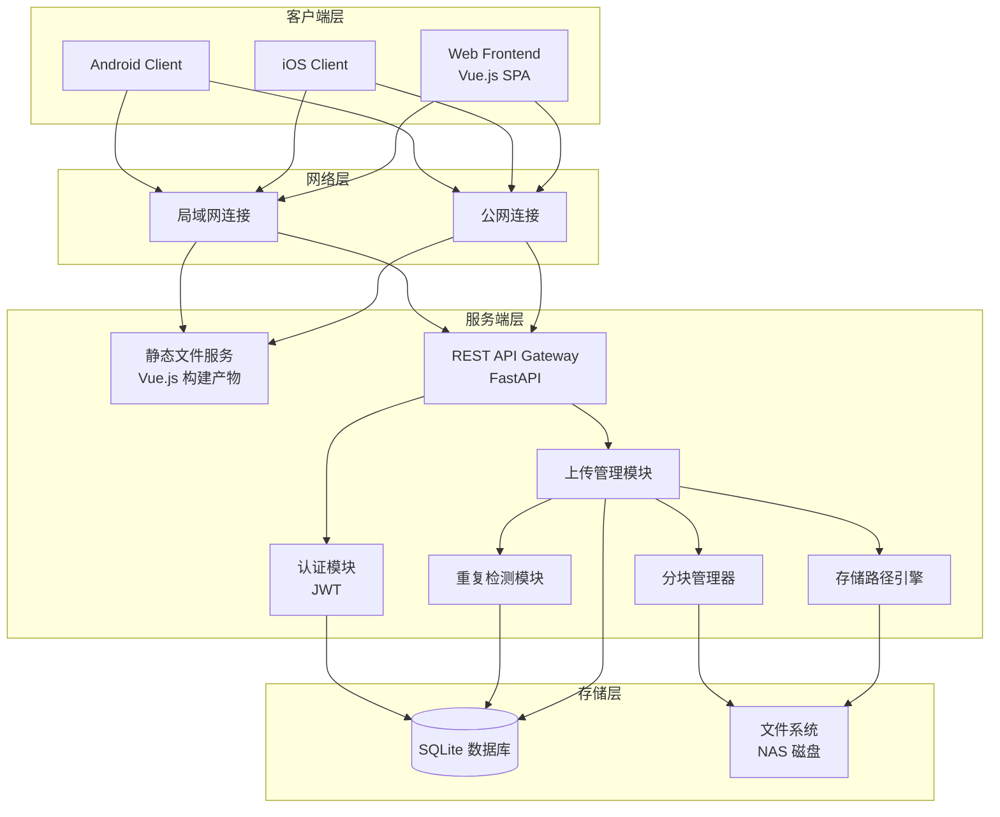
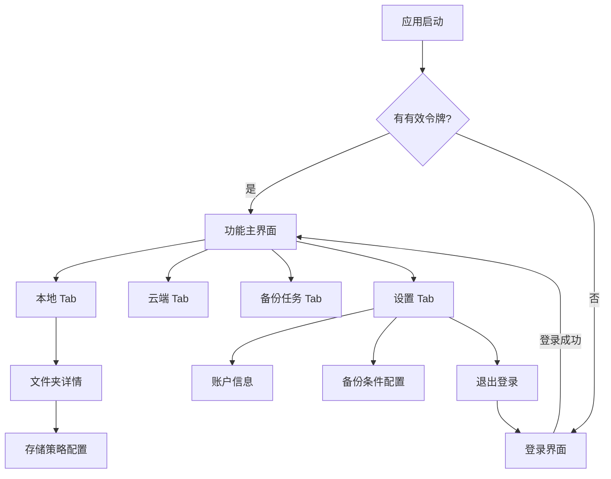
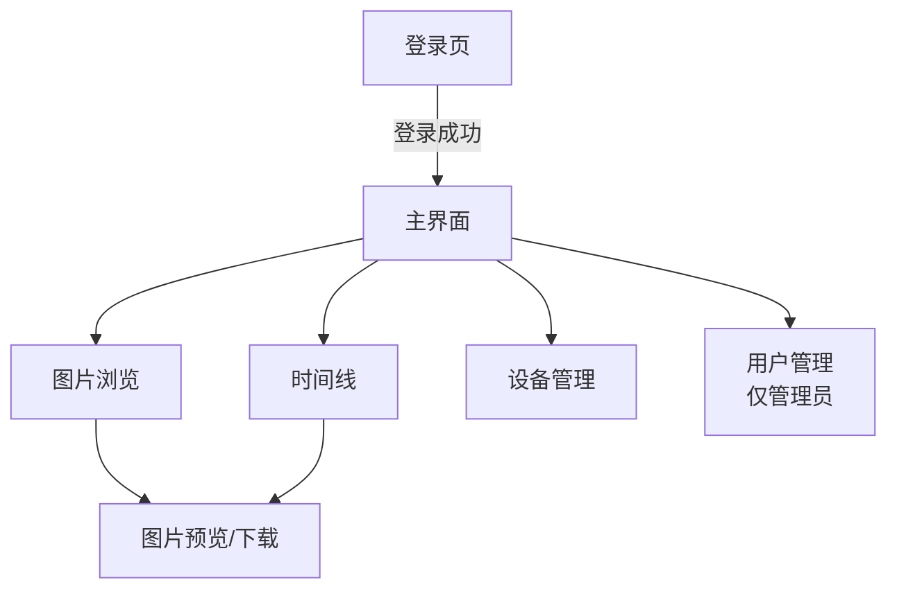
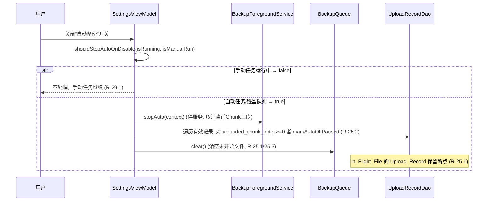
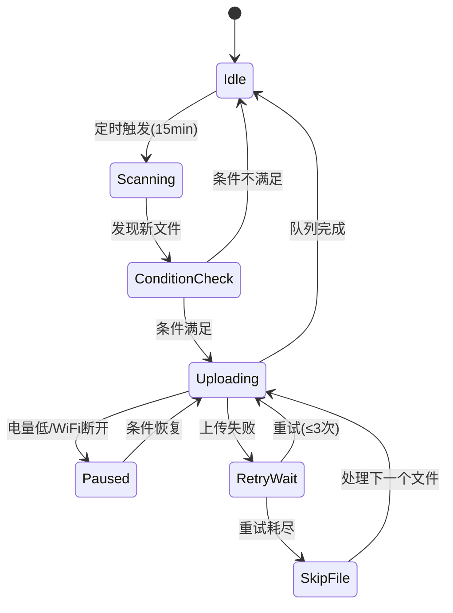

# 技术设计文档：手机图片备份系统

## 概述

本系统是一套手机图片备份解决方案，采用前后端分离架构。服务端使用 Python (FastAPI) 部署在 x86 Linux NAS 上，提供统一的 RESTful API 接口；客户端包括 Android、iOS 移动端和 Vue.js Web 前端，三端共用同一套 API。

系统核心能力包括：
- 公网/局域网双通道连接，优先局域网
- 原图无损备份，保留完整元数据
- 后台低功耗自动备份，条件触发
- 多用户隔离存储
- 基于分块的断点续传
- SHA-256 哈希重复检测
- 灵活的存储路径策略（正交选项组合）
- 图片与视频统一备份（Android 同时扫描 MediaStore 图片与视频集合）
- 动态照片（Motion Photo）与 Ultra HDR 识别，及动态照片视频流提取
- 视频封面缩略图（ffmpeg 抽帧）与视频 HTTP Range 流式播放
- Web 端图片/视频浏览、时间线视图与管理

## 架构

### 系统架构图



### 技术选型

| 组件 | 技术选择 | 理由 |
|------|----------|------|
| 服务端框架 | FastAPI | 异步支持好，性能优秀，自动生成 API 文档 |
| 反向代理/HTTPS | Caddy | 自动 HTTPS 证书管理，配置简单，适合自部署 |
| Web 前端 | Vue.js 3 + Vite | 轻量、响应式、生态成熟，构建产物可由 FastAPI 直接 serve |
| Web UI 库 | Element Plus | 组件丰富，适合管理类界面 |
| 数据库 | SQLite | 轻量级，无需额外部署，适合 NAS 场景 |
| 认证 | JWT (PyJWT) | 无状态认证，适合移动端和 Web 端 |
| 文件哈希 | SHA-256 | 安全性高，碰撞概率极低 |
| 图片处理 | Pillow + pillow-heif + rawpy | 覆盖 HEIC、RAW 等格式的缩略图生成 |
| 客户端网络 | Retrofit (Android) / URLSession (iOS) | 平台原生，支持断点续传 |
| 客户端存储 | Room (Android) / Core Data (iOS) | 平台推荐的持久化方案 |

### 通信协议

- 传输协议：HTTPS（通过 Caddy 反向代理，自动管理 TLS 证书）
- 局域网可选：HTTP 直连（纯内网部署时）
- API 风格：RESTful
- 数据格式：JSON（元数据）+ Binary（文件块）
- 认证方式：Bearer Token (JWT)

### 部署架构

```
┌─────────────────────────────────────────────┐
│  NAS (x86 Linux)                            │
│                                             │
│  ┌─────────┐      ┌──────────────────────┐  │
│  │  Caddy  │─────▶│  FastAPI (127.0.0.1) │  │
│  │ :443/:80│      │  :8000               │  │
│  └─────────┘      │  ├─ /api/v1/*        │  │
│       ▲           │  └─ /* (Vue.js SPA)  │  │
│       │           └──────────────────────┘  │
│  公网/局域网                                  │
└─────────────────────────────────────────────┘
```

- **Caddy**：负责 HTTPS 终止、自动证书管理、反向代理
- **FastAPI**：仅监听 localhost，serve API + Vue.js 静态文件
- **Caddyfile 模板**：用户只需修改域名即可部署

```
your-domain.com {
    reverse_proxy 127.0.0.1:8000
}
```

## 组件与接口

### 服务端组件

#### 1. API Gateway (FastAPI 应用)

负责路由分发、请求验证和响应格式化。

```python
# 核心 API 端点
POST   /api/v1/setup/init             # 首次部署引导（创建管理员）
GET    /api/v1/setup/status            # 检查是否已初始化

POST   /api/v1/auth/login              # 用户登录
POST   /api/v1/auth/refresh            # 刷新令牌
GET    /api/v1/connection/test          # 测试连接

POST   /api/v1/backup/check            # 重复检测
POST   /api/v1/backup/init             # 初始化上传任务
POST   /api/v1/backup/chunk            # 上传分块
POST   /api/v1/backup/complete         # 完成上传
GET    /api/v1/backup/resume/{file_id}  # 获取续传信息

GET    /api/v1/files/browse             # 浏览目录结构
GET    /api/v1/files/list               # 列出目录下的文件（支持排序）
GET    /api/v1/files/all                # 列出用户所有文件（扁平、递归，供时间线使用）
GET    /api/v1/files/devices            # 各设备文件数量统计
GET    /api/v1/files/thumbnail/{file_id}  # 获取缩略图（视频用 ffmpeg 抽帧生成封面）
GET    /api/v1/files/download/{file_id}   # 下载/流式播放原图或视频（媒体文件 inline + 支持 HTTP Range）
GET    /api/v1/files/motion/{file_id}     # 流式返回动态照片内嵌的 MP4 视频（支持 HTTP Range）

GET    /api/v1/admin/users              # 用户管理（管理员）
POST   /api/v1/admin/users              # 创建用户
DELETE /api/v1/admin/users/{id}         # 删除用户
PUT    /api/v1/admin/users/{id}/password  # 修改密码
GET    /api/v1/admin/status             # 系统状态（存储路径、磁盘用量）
```

#### 2. 认证模块 (AuthService)

```python
class AuthService:
    def login(username: str, password: str) -> TokenPair
    def verify_token(token: str) -> UserInfo
    def refresh_token(refresh_token: str) -> TokenPair
    def create_user(username: str, password: str) -> User
    def delete_user(user_id: int) -> bool
    def change_password(user_id: int, new_password: str) -> bool
```

- 密码存储：bcrypt 哈希（cost factor = 12）
- 令牌有效期：access_token 24小时，refresh_token 7天
- 最大用户数：20

#### 3. 上传管理模块 (UploadService)

```python
class UploadService:
    def check_duplicate(user_id: int, file_hash: str, file_path: str) -> DuplicateCheckResult
    def init_upload(user_id: int, file_info: FileInfo) -> UploadSession
    def upload_chunk(session_id: str, chunk_index: int, data: bytes, checksum: str) -> ChunkResult
    def complete_upload(session_id: str) -> UploadResult
    def get_resume_info(user_id: int, file_id: str) -> ResumeInfo
```

#### 4. 存储路径引擎 (StoragePathEngine)

```python
class StoragePathEngine:
    def resolve_path(
        storage_root: str,
        username: str,
        device_name: str,
        source_folder: str,
        policy: StoragePolicy,
        file_metadata: FileMetadata
    ) -> str
    
    def validate_path(path: str) -> PathValidationResult
    def sanitize_device_name(name: str) -> str
```

路径解析规则（四种组合）：
1. 不手动指定 + 不按年月：`{root}/{user}/{device}/{source_folder}/`
2. 不手动指定 + 按年月：`{root}/{user}/{device}/{source_folder}/{year}/{month}/`
3. 手动指定 + 不按年月：`{custom_path}/{source_folder}/`
4. 手动指定 + 按年月：`{custom_path}/{source_folder}/{year}/{month}/`

#### 5. 分块管理器 (ChunkManager)

```python
class ChunkManager:
    CHUNK_SIZE = 2 * 1024 * 1024  # 2MB
    
    def create_session(file_id: str, total_chunks: int) -> str
    def store_chunk(session_id: str, chunk_index: int, data: bytes) -> bool
    def get_received_chunks(session_id: str) -> List[int]
    def merge_chunks(session_id: str) -> str  # 返回合并后文件路径
    def cleanup_session(session_id: str) -> None
```

#### 6. 重复检测模块 (DeduplicationService)

```python
class DeduplicationService:
    def check(user_id: int, file_hash: str) -> Optional[FileRecord]
    def create_reference(user_id: int, file_hash: str, target_path: str, source_record: FileRecord) -> FileRecord
    def register_file(user_id: int, file_hash: str, file_path: str, file_size: int) -> FileRecord
```

#### 7. 文件浏览服务 (FileBrowseService)

```python
class FileBrowseService:
    def list_directory(user_id: int, path: str) -> DirectoryListing
    def get_file_info(user_id: int, file_id: int) -> FileDetail
    def get_thumbnail(user_id: int, file_id: int, size: ThumbnailSize) -> bytes
    def get_original(user_id: int, file_id: int) -> StreamingResponse
    def search_files(user_id: int, query: str, filters: SearchFilters) -> List[FileRecord]
```

**目录浏览接口说明：**

```python
# 浏览目录结构
# GET /api/v1/files/browse?path=/DCIM/Camera
class DirectoryListing(BaseModel):
    current_path: str
    parent_path: Optional[str]
    directories: List[DirectoryInfo]   # 子目录列表
    files: List[FileInfo]              # 当前目录下的文件
    total_files: int
    page: int
    page_size: int

class DirectoryInfo(BaseModel):
    name: str
    path: str
    file_count: int                    # 该目录下的文件总数（含子目录）
    latest_file_time: Optional[str]    # 最新文件的时间

class FileBrowseInfo(BaseModel):
    id: int
    file_name: str
    file_size: int
    mime_type: str
    media_type: str = "image"          # 'image' | 'video'
    is_motion_photo: bool = False      # 是否为动态照片
    is_ultra_hdr: bool = False         # 是否为 Ultra HDR
    exif_time: Optional[str]
    thumbnail_url: str                 # 缩略图 URL
    created_at: str
    device_name: Optional[str] = None  # /files/all 返回，供时间线设备筛选
    focal_length: Optional[float] = None  # 供时间线焦段筛选
```

**缩略图生成策略：**
- 首次请求时生成缩略图并缓存到 `{Storage_Root}/.thumbnails/{user}/` 目录
- 缩略图尺寸：小图 200x200（列表用）、中图 600x600（预览用）
- 使用 Pillow 库生成，保持宽高比，居中裁剪
- 缩略图文件名：`{file_hash}_{size}.jpg`
- RAW 格式：优先提取嵌入预览图，无预览时使用 rawpy 解码
- HEIC/HEIF：使用 pillow-heif 插件解码

**支持的文件格式：**

| 类别 | 格式 | 缩略图生成方式 |
|------|------|---------------|
| 通用图片 | JPEG, PNG, WebP, GIF, BMP, TIFF | Pillow 直接处理 |
| 手机格式 | HEIC/HEIF, AVIF | pillow-heif / pillow-avif 插件 |
| 相机 RAW | DNG, CR2, CR3, NEF, ARW, ORF, RAF, RW2 | rawpy 解码或提取嵌入预览 |
| 动态内容 | Live Photo (HEIC+MOV), Motion Photo (嵌入视频) | 图片部分生成缩略图 |

**视频处理：**

- 上传流程与图片完全一致（分块、去重、完整性校验均与内容无关），无需特殊处理即可备份视频
- 服务端在注册文件记录时，根据 MIME 类型 / 扩展名推断 `media_type`（`image` / `video`）并持久化
- **视频缩略图**：`FileBrowseService._generate_video_thumbnail` 通过 `ffmpeg -ss 00:00:01 -frames:v 1` 抽取一帧（极短视频回退到首帧），再用 Pillow 缩放为封面；ffmpeg 不可用时返回 None，客户端以占位图 + 播放角标兜底（Dockerfile 已安装 ffmpeg）
- **视频播放**：`GET /api/v1/files/download/{file_id}` 对媒体文件使用 `Content-Disposition: inline` 并支持 HTTP Range（返回 206 Partial Content），使浏览器可流式播放与拖动进度

**动态照片 / Ultra HDR 识别（`app/services/motion_photo.py`）：**

```python
def detect_motion_photo(file_path: str) -> tuple[bool, Optional[int]]
    # 返回 (是否动态照片, 内嵌视频起始字节偏移)
def detect_ultra_hdr(file_path: str) -> bool
```

- **Android Motion Photo**（参考 [Motion Photo 规范](https://developer.android.com/media/platform/motion-photo-format)）：
  - 解析主图 XMP：旧格式 `GCamera:MicroVideoOffset`（自文件尾部起算的视频长度）；新格式 `GCamera:MotionPhoto=1` + Container 中语义为 `MotionPhoto`、MIME 为 `video/mp4` 的 Item 的 `Length`
  - 内嵌视频起始偏移 `motion_video_offset = file_size - video_length`；无有效 XMP 时回退扫描 JPEG EOI 之后的 MP4 `ftyp` 盒
  - `GET /api/v1/files/motion/{file_id}` 仅返回 `[offset, EOF)` 的字节（`video/mp4` + Range）
  - 注：部分机型动态视频编码为 HEVC(H.265)，Safari 可直接播放，Chrome/Firefox 视系统解码能力而定
- **Ultra HDR**（参考 [Ultra HDR 规范](https://developer.android.com/media/platform/hdr-image-format)）：主图 XMP 含 `hdr-gain-map`（`hdrgm`）命名空间或语义为 `GainMap` 的 Container Item 即判定为 Ultra HDR
- 识别在 `complete_upload` 注册文件时执行，结果写入 `file_records.is_motion_photo` / `motion_video_offset` / `is_ultra_hdr`；并提供对历史记录的批量补测
- **iPhone Live Photo**：HEIC/JPEG 图片 + 同名 MOV 文件，通过文件名关联，数据库中以 `live_photo_group_id` 关联

**服务端配置文件 (config.yaml)：**

```yaml
server:
  host: "127.0.0.1"
  port: 8000

storage:
  root: "/data/photovault"  # 用户可自定义

auth:
  access_token_expire_hours: 24
  refresh_token_expire_days: 7
  max_users: 20

backup:
  chunk_size_mb: 2
  session_expire_days: 7
```

### 客户端交互设计

#### 整体导航结构



#### 登录界面

**布局结构：**
- 顶部：应用 Logo + 名称
- 中部：表单区域
  - 服务器地址输入框（placeholder: `192.168.1.100:8080`）
  - 用户名输入框
  - 密码输入框（带显示/隐藏切换按钮）
  - "记住密码"复选框
- 底部：操作按钮区域
  - "测试连接"按钮（次要样式，点击后显示加载动画，10秒内返回结果）
  - "登录"按钮（主要样式，全宽）

**交互流程：**
1. 启动时检查本地是否有保存的凭证，有则自动填充
2. 用户输入服务器地址后可点击"测试连接"验证网络可达性
3. 测试连接结果以 Toast/Snackbar 形式显示（✓ 连接成功 / ✗ 连接失败 + 原因）
4. 点击"登录"前验证三个字段非空，空字段高亮红色边框并显示提示文字
5. 登录过程中按钮显示加载状态，禁止重复点击
6. 登录失败在表单上方显示红色错误横幅（如"用户名或密码错误"、"服务器不可达"）

#### 功能主界面 — 本地 Tab

**布局结构：**
- 顶部状态栏：连接状态指示（绿色圆点=已连接/灰色=未连接）+ 连接方式（局域网/公网）
- 内容区：文件夹列表（卡片式）
  - 每个卡片显示：文件夹名称、图片总数、已备份数、备份进度百分比
  - 右侧显示备份状态图标（✓ 全部已备份 / ⟳ 备份中 / ⚠ 有待备份）
- 底部：添加备份文件夹按钮（FAB 浮动按钮）

**交互流程：**
1. 点击文件夹卡片 → 进入文件夹详情页，显示该文件夹下的图片缩略图网格
2. 图片缩略图右下角显示备份状态小图标（✓ 已备份 / 待备份无标记）
3. 点击 FAB → 打开系统文件夹选择器，选择要备份的文件夹
4. 选择文件夹后 → 弹出存储策略配置底部弹窗
5. 长按文件夹卡片 → 显示操作菜单（配置策略 / 移除备份文件夹）

#### 功能主界面 — 云端 Tab

**布局结构：**
- 顶部：路径面包屑导航（如 `/ > alice > Pixel9Pro > DCIM`）
- 内容区：文件/文件夹列表
  - 文件夹显示：文件夹图标 + 名称 + 文件数量
  - 文件显示：缩略图 + 文件名 + 大小 + 备份时间
- 空状态：显示引导文案"还没有备份文件，去本地 Tab 添加备份文件夹吧"

**交互流程：**
1. 点击文件夹 → 进入子目录，面包屑更新
2. 点击面包屑中的任意层级 → 跳转到对应目录
3. 点击文件 → 全屏预览图片
4. 下拉刷新 → 重新加载当前目录内容

#### 功能主界面 — 备份任务 Tab

**布局结构：**
- 顶部：分段控制器（当前任务 / 历史记录）
- 当前任务视图：
  - **备份控制条**：一个"开始/暂停"按钮，控制当前备份任务（进行中显示"暂停"，已暂停或空闲显示"开始"；队列为空且无进行中任务时禁用）
  - 正在上传的文件：文件名 + 进度条 + 速度 + 剩余时间
  - 排队中的文件列表：文件名 + 文件大小 + 等待状态
  - 暂停状态提示：区分"用户暂停"与"条件暂停"（电量不足/WiFi断开）+ 恢复条件；用户暂停时提示"已手动暂停，点击开始继续"
  - **已暂停任务清单（关闭自动备份产生，需求 26）**：来源为持久化 Upload_Record 的 `AUTO_OFF` 条目，每条显示文件名 + 已上传进度百分比 + "已暂停 · 自动备份已关闭"文案 + "继续"按钮；长按条目弹出"清除"选项框；按暂停时间由近到远排序；为空时展示空状态；不随电量/WiFi 恢复自动续传
- 历史记录视图：
  - 按日期分组的备份记录列表
  - 每条记录：文件名 + 大小 + 备份时间 + 状态（成功/失败/跳过）
  - 失败记录可点击重试

**交互流程：**
1. 正在上传时显示实时进度和传输速度
2. 暂停状态下显示恢复条件提示（如"将在 WiFi 连接后自动恢复"）
3. 点击失败记录 → 显示失败原因 + "重试"按钮
4. 历史记录支持按状态筛选（全部/成功/失败）

#### 功能主界面 — 设置 Tab

**布局结构：**
- 分组列表形式：
  - **备份条件**组：
    - 自动备份开关（默认开启 — 关闭后仅"立即备份"FAB 可触发备份，所有自动触发方式不再上传）
    - WiFi 开关（默认开启，不可关闭 — 仅 WiFi 下备份）
    - 最低电量滑块（默认 50%，范围 20%-80%）
    - 扫描间隔（默认 15 分钟，可选 5/15/30/60 分钟）
  - **存储策略管理**组：
    - 已配置的文件夹列表，点击可修改策略
  - **账户信息**组：
    - 当前用户名
    - 服务器地址
    - 连接状态
  - **操作**组：
    - 退出登录按钮（红色文字）

#### 存储策略配置弹窗

**布局结构（底部弹窗 BottomSheet）：**
- 标题：`配置存储策略 — {文件夹名}`
- 选项区域：
  - Switch 1：手动指定存储目录（默认关闭）
    - 开启后展开：目标路径输入框 + 路径验证状态
  - Switch 2：按年月分层（默认关闭）
- 路径预览区域：
  - 实时显示根据当前选项组合生成的示例路径
  - 如：`/data/alice/Pixel9Pro/DCIM/Camera/2026/03/`
- 底部：保存按钮

**交互流程：**
1. 切换任一 Switch → 路径预览实时更新
2. 开启"手动指定"→ 展开路径输入框，输入时实时验证字符合法性
3. 路径不合法时输入框变红 + 显示错误提示（如"包含非法字符"）
4. 点击保存 → 如果开启了手动指定，先向服务端验证路径可用性
5. 验证通过 → 保存配置，关闭弹窗
6. 验证失败 → 显示错误提示，不关闭弹窗

#### 状态指示设计

| 状态 | 视觉表现 | 位置 |
|------|----------|------|
| 已连接(局域网) | 绿色圆点 + "局域网" | 顶部状态栏 |
| 已连接(公网) | 绿色圆点 + "公网" | 顶部状态栏 |
| 未连接 | 灰色圆点 + "未连接" | 顶部状态栏 |
| 备份中 | 蓝色旋转图标 | 文件夹卡片 |
| 已暂停(条件) | 黄色暂停图标 + 恢复条件 | 备份任务页 |
| 已暂停(用户) | 灰色暂停图标 + "点击开始继续" | 备份任务页 |
| 已暂停(自动备份关闭) | 灰色暂停图标 + "自动备份已关闭，点击继续手动续传" + 每条目"继续"按钮 | 备份任务页已暂停清单 |
| 备份完成 | 绿色对勾 | 文件缩略图 |
| 备份失败 | 红色感叹号 | 历史记录 |

### Web 前端设计

#### 技术架构

- **框架**：Vue.js 3 (Composition API) + Vue Router + Pinia
- **构建工具**：Vite
- **UI 组件库**：Element Plus
- **HTTP 客户端**：Axios
- **部署方式**：构建为静态文件，由 FastAPI 通过 `StaticFiles` 中间件直接 serve，无需额外 Web 服务器

```python
# FastAPI 中 serve Vue.js 构建产物
from fastapi.staticfiles import StaticFiles

app.mount("/", StaticFiles(directory="web/dist", html=True), name="web")
```

#### 页面结构



#### 登录页

- 居中卡片式布局，包含用户名、密码输入框和登录按钮
- 支持"记住登录状态"（将 JWT 存入 localStorage）
- 登录成功后跳转到图片浏览页

#### 图片浏览页（主页）

- **左侧边栏**：目录树导航（设备 → 文件夹层级）
- **右侧内容区**：
  - 顶部工具栏：路径面包屑 + 视图切换（网格/列表）+ 排序选项
  - 图片网格：缩略图展示，悬浮显示文件名和大小
  - 分页/无限滚动加载
- **图片预览**：点击图片弹出 Lightbox，支持左右切换、缩放、下载原图

#### 时间线页

- 按年月分组展示所有备份图片
- 左侧时间轴导航，点击快速跳转
- 支持按日期范围筛选

#### 设备管理页

- 展示当前用户的所有备份设备
- 每个设备卡片显示：设备名、备份文件数、占用空间、最后备份时间
- 点击设备进入该设备的文件浏览

#### 用户管理页（仅管理员可见）

- 用户列表：用户名、创建时间、备份文件数、占用空间
- 操作：创建用户、删除用户、重置密码

#### Web 前端与 API 的关系

Web 前端与移动客户端共用完全相同的 API 端点，不需要额外的后端接口。主要使用的 API：

| Web 页面 | 使用的 API |
|----------|-----------|
| 初始化引导 | `POST /api/v1/setup/init` |
| 登录 | `POST /api/v1/auth/login` |
| 图片浏览 | `GET /api/v1/files/browse`, `GET /api/v1/files/list` |
| 时间线 | `GET /api/v1/files/all`（含 media_type / is_motion_photo / is_ultra_hdr / device_name / focal_length） |
| 缩略图 | `GET /api/v1/files/thumbnail/{file_id}`（视频为封面帧） |
| 原图下载 / 视频播放 | `GET /api/v1/files/download/{file_id}`（inline + Range） |
| 动态照片视频 | `GET /api/v1/files/motion/{file_id}`（内嵌 MP4 + Range） |
| 文件上传 | `POST /api/v1/backup/check`, `POST /api/v1/backup/init`, `POST /api/v1/backup/chunk`, `POST /api/v1/backup/complete` |
| 用户管理 | `GET/POST/DELETE /api/v1/admin/users` |
| 系统状态 | `GET /api/v1/admin/status`（Storage_Root 路径、磁盘用量） |

#### 初始化引导页

- 首次部署时（数据库无用户），所有请求重定向到引导页
- 引导页要求设置管理员用户名和密码（密码 ≥ 8 字符）
- 可选配置 Storage_Root 路径
- 完成后自动跳转到登录页

#### Web 端上传功能

- **上传入口**：图片浏览页顶部工具栏的"上传"按钮
- **上传方式**：拖拽区域 + 文件选择器，支持多文件批量选择
- **上传配置**：选择目标路径 + 是否按年月分层
- **上传流程**：与移动端一致（SHA-256 去重检测 → 分块上传 → 完成验证）
- **进度展示**：底部浮动面板显示上传队列、单文件进度条、整体进度
- **大文件支持**：使用 Web Worker 计算 SHA-256，避免阻塞 UI

### 客户端组件（移动端）

#### 1. 连接管理器 (ConnectionManager)

```
interface ConnectionManager {
    fun connect(serverAddress: String): ConnectionResult
    fun testConnection(serverAddress: String): TestResult
    fun getConnectionType(): ConnectionType  // LAN or WAN
}
```

连接策略：
1. 先尝试局域网地址（10秒超时）
2. 局域网失败后尝试公网地址（15秒超时）
3. 均失败则报错，等待下次 Backup_Condition 满足时重试

#### 2. 后台扫描服务 (BackgroundScanService)

```
interface BackgroundScanService {
    fun startPeriodicScan(interval: Duration = 15.minutes)
    fun scanSourceFolders(): List<NewFile>
    fun checkBackupCondition(): Boolean  // 电量>50% && WiFi
}
```

**媒体扫描（图片 + 视频）：**
- `BackgroundScanWorker` 对每个 Source_Folder 同时查询 `MediaStore.Images` 与 `MediaStore.Video`（通过共享的 `MediaStore.MediaColumns` 复用同一查询），合并两类结果后按状态分类并入队
- `MediaStoreObserver` 同时监听图片与视频集合的变化，媒体库新增时触发一次增量扫描
- 权限：清单声明 `READ_MEDIA_IMAGES` + `READ_MEDIA_VIDEO`（Android 13+），启动时一并申请
- **能力版本回扫**：`SettingsPreferences.CURRENT_MEDIA_BACKFILL_VERSION` 记录已回扫的扫描能力版本；升级后若落后则触发一次强制全量扫描（`runNow`，独立的 WorkManager 唯一任务名，避免被增量扫描替换），补备历史视频/动态照片，每个版本仅执行一次

**备份触发方式与"自动备份"开关：**

备份的完整链路为：*扫描发现新文件 → 入队 `BackupQueue` → 满足条件时启动 `BackupForegroundService` 上传*。触发这条链路的入口分为两类：

- 自动触发（受"自动备份"开关约束）：
  - 周期扫描：`BackgroundScanWorker` 每 15 分钟（可配）一次
  - 媒体库变化监听：`MediaStoreObserver` 防抖后触发 `runOnce` 增量扫描
  - 电量/网络条件恢复：`ConditionCheckWorker` 恢复/续传已暂停的备份
  - 开机重调度：`BootCompletedReceiver`
  - 升级后全量回扫：能力版本回扫（`runNow`，非手动）
  - 新增文件夹后的即时扫描：`runOnce`
  - 进程被杀后的队列重建：`requeueResumableUploads` 从持久化的 `UploadRecord` 重建待续传队列
- 手动触发（无视开关）：本地 Tab 的"立即备份"FAB → `runNow(manual = true)`

`SettingsPreferences.autoBackupEnabled`（默认 `true`，持久化）控制上述自动触发：

- 开启：所有自动触发在满足 `Backup_Condition` 时正常入队并上传
- 关闭：`BackgroundScanWorker.doWork` 计算 `allowBackup = manual || autoBackupEnabled`；`allowBackup=false` 时仍执行状态同步与文件夹计数刷新，但**不入队新文件、不重建续传队列、不启动备份服务**，并**冻结各文件夹的 `lastScanTime`**（避免关闭期间新增文件落后于扫描时间戳而在重新开启后被增量扫描漏掉）；`ConditionCheckWorker` 的自动启动/续传分支同样被开关门控（仍允许在条件恶化时暂停正在进行的手动备份）
- 手动"立即备份"通过 `KEY_MANUAL_BACKUP` 标记 `manual=true`，无视开关执行全量扫描与备份（仍需通过网络/电量/服务端连通预检）
- 注：单张"重新备份"与备份任务页的"重试"属于显式的逐项用户操作，不受"自动备份"开关约束

**运行中关闭"自动备份"开关的处理（R-3.13/3.14/3.15）：**

此前仅门控了备份的*启动*：`allowBackup` 阻止自动触发器发起新的备份，但对一次**已经在运行**的 `BackupForegroundService` 没有任何拦截——上传循环 `while (backupQueue.size() > 0 && !isPaused)` 只检查网络/电量条件，不读取 `autoBackupEnabled`。这导致一次自动备份启动后，中途关闭开关也无法停止它，队列里剩余的文件会继续传完（一个逻辑缺陷）。

修复方案是让备份服务记住**每次运行的来源**，并让开关的关闭动作作用于正在运行的任务：

- **来源标记**：`BackupForegroundService.start(context, manual: Boolean)` 通过 Intent extra `KEY_MANUAL_RUN` 传入本次运行是否由用户手动发起，服务将其保存为 `@Volatile var isManualRun`。所有手动入口（`LocalTabViewModel.doBackupNow`、`FolderDetailViewModel` 单张重新备份、`TasksTabViewModel` 重试）传 `manual=true`；所有自动入口（`BackgroundScanWorker`、`ConditionCheckWorker`）传 `manual=false`。
- **关闭开关的动作**：`SettingsViewModel.setAutoBackupEnabled(false)` 在写入偏好后，检查 `BackupForegroundService.isRunning`：
  - 若正在运行且 `isManualRun == true`：不做任何中止（手动任务继续跑完，R-3.15）。
  - 否则（自动任务运行中，或服务未运行但队列中残留自动入队的文件）：调用 `BackupForegroundService.stopAuto(context)` 停止服务并 `backupQueue.clear()` 清空排队文件（R-3.14）。正在上传中的当前文件因 `ChunkUploader` 已持久化分块进度，其断点续传记录被保留，开关再次开启后可续传。
- 由于 `SettingsPreferences` 与服务/队列分属不同层，清空与停止的编排放在 `SettingsViewModel`（持有 `@ApplicationContext` 与注入的 `BackupQueue`），避免在偏好存储层引入服务依赖。

**备份任务的手动开始/暂停（R-24）：**

`BackupForegroundService` 扩充暂停语义，区分**用户暂停**与**条件暂停**：

- 新增 `ACTION_RESUME` 与 `@Volatile var isUserPaused` 状态；原有 `isPaused` 保留为"因任意原因暂停"的合并态，配套 `pauseReason`（`USER` / `CONDITION`）。
- `ACTION_PAUSE`（用户点击"暂停"）：置 `isUserPaused=true`、`pauseReason=USER`，取消 `backupJob`，通知栏显示"已暂停（手动）"。
- `ACTION_RESUME`（用户点击"开始"）：清 `isUserPaused`，若满足 `Backup_Condition` 则重新进入上传循环从断点续传。
- `ConditionCheckWorker` 的自动续传分支在存在用户暂停时**不得**自动恢复（用户暂停优先于条件恢复，R-24.5）；仅 `pauseReason==CONDITION` 的暂停才在条件恢复后自动续传。
- `TasksTab` 订阅服务运行/暂停状态（经 `BackupForegroundService.isRunning` / `isPaused` 暴露的可观察状态或 `TasksTabViewModel` 轮询/StateFlow），据此渲染"开始/暂停"按钮：进行中显示"暂停"、暂停或空闲显示"开始"；`backupQueue` 为空且无进行中任务时禁用按钮（R-24.1/24.4）。

**用户手动暂停的持久化与恢复触发（R-24.5 扩展）：**

原设计中用户手动暂停仅由内存 `isUserPaused` 表示，且只能由用户再次点击"开始"恢复。现扩展为：

- **持久化**：`SettingsPreferences.userPausedBackup` 落盘。`ACTION_PAUSE(USER)` 置真、`ACTION_RESUME` 与 `stopBackup()`（真正停止/停完/`stopAuto`）置假；`onDestroy`（进程被杀）**不**清除，因此"暂停中被杀"重启后仍保持暂停，不被自动触发器静默续传。
- **恢复触发（除用户点击"开始"外）新增三条，均经 `ACTION_RESUME` 清标志并从断点续传**：
  1. **再次打开"自动备份"开关**：`SettingsViewModel.setAutoBackupEnabled(true)` 检测到 `userPausedBackup` 即 `resume`。
  2. **点击"立即备份"FAB**：`LocalTabViewModel.backupNow` 预检通过后若 `userPausedBackup` 即 `resume`（同步先于异步扫描，故扫描 worker 见到标志已清、走常规启动）。
  3. **自动周期扫描**（统一以 `manual==false` 为闸门）：`BackgroundScanWorker` 经纯函数 `decidePausedResumeAction(allowBackup,isManualRun,userPaused,isForeground)` 决策——App 在后台 → `resume` 静默续传；App 在前台 → `BackupResumePrompt.request()`，由 `MainScreen` 弹窗让用户确认「继续/保持暂停」。前后台由 `AppForegroundState`（`ActivityLifecycleCallbacks` 计数）判定。被"保持暂停"后，后续周期扫描会**再次弹窗**（按产品决策，允许重复提醒）。
- `ConditionCheckWorker` 的门控读取 `isUserPaused || settingsPreferences.getUserPausedBackup()`，保证被杀后条件恢复仍不续传用户暂停。
- `TasksTabViewModel` 在 `init` 从持久化重建队列，并在 `refreshCurrentTasks` 以 `heldByUserPause = !isRunning && getUserPausedBackup()` 让"暂停中被杀"在任务页仍显示为已暂停、"开始"按钮可用。

**备份方式总结表：**

| 触发方式 | 入口 / 代码 | 类型 | 扫描范围 | 受"自动备份"开关约束 | 说明 |
| --- | --- | --- | --- | --- | --- |
| 周期扫描 | `BackgroundScanWorker.schedule`（默认 15 分钟） | 自动 | 增量 | 是 | 兜底：应对进程被杀、事件丢失；国产 ROM 上尤为重要 |
| 媒体库变化监听 | `MediaStoreObserver` → `runOnce`（2s 防抖） | 自动 | 增量 | 是 | 低延迟：拍照/新增媒体后尽快备份 |
| 电量/网络条件恢复 | `ConditionBroadcastReceiver` → `ConditionCheckWorker` | 自动 | 不扫描（处理已入队） | 是 | 充电/连 WiFi 后自动启动或续传；断网/低电量则暂停 |
| 开机重调度 | `BootCompletedReceiver` → `schedule` | 自动 | 增量 | 是 | 重启后重新注册周期扫描 |
| 升级后全量回扫 | 能力版本回扫 → `runNow(manual=false)` | 自动 | 全量 | 是 | 新增媒体类型支持后补备历史文件，每版本一次 |
| 新增文件夹即时扫描 | `LocalTabViewModel.saveNewFolder` → `runOnce` | 自动 | 增量 | 是 | 添加文件夹后无需等待下个周期 |
| 进程被杀后队列重建 | `BackgroundScanWorker.requeueResumableUploads` | 自动 | 由持久化 `UploadRecord` 重建 | 是 | 内存队列丢失后，从磁盘记录恢复断点续传 |
| 立即备份（FAB） | `LocalTabViewModel.doBackupNow` → `runNow(manual=true)` | 手动 | 全量 | 否 | 无视开关；仍需网络/电量/服务端连通预检 |
| 单张"重新备份" | `FolderDetailViewModel` → `enqueue` + `BackupForegroundService.start` | 手动 | 单文件 | 否 | 对回收站/已删除照片强制重传（`forceReupload`） |
| 任务页"重试" | `TasksTabViewModel` → `enqueue` + `BackupForegroundService.start` | 手动 | 单文件 | 否 | 重传失败任务 |

> 关闭"自动备份"后，所有"自动"行仅扫描以刷新状态/计数，不入队、不启动上传，并冻结各文件夹的 `lastScanTime`；所有"手动"行不受影响。所有方式都会跳过本地 `photo_status` 标记为 trashed/purged 的文件（仅"单张重新备份"可强制重传）。
>
> 此外，**运行中**关闭"自动备份"开关：正在进行的**自动**任务会被立即停止并清空排队队列（当前文件保留断点续传进度）；正在进行的**手动**任务不受影响，继续跑完。详见上文"运行中关闭'自动备份'开关的处理"。

**关闭自动备份后保留已暂停任务（需求 25-33，仅 Android；iOS 见需求 33 为后续可选项）：**

本组设计是对 R-3.14（"关闭自动备份停止自动任务、保留正在上传文件断点"）的 **UI 层扩展**：让那个被保留断点的 In_Flight_File 成为"备份任务"Tab 上可见的 `AUTO_OFF` 已暂停条目，并支持逐个"继续"续传与长按"清除"。R-3.14 的核心行为（停服务、清空未开始队列、保留当前文件断点）**不变**，仅在其基础上增加标记、展示与操作。

术语沿用 requirements：In_Flight_File（有 Upload_Record 的正在上传文件）、Queued_Not_Started_File（在 `BackupQueue` 中尚未开始、无 Upload_Record 的文件）、Paused_Task（数据来源为持久化 Upload_Record 的"已暂停"展示条目）、Pause_Source ∈ {USER, CONDITION, AUTO_OFF}。

**1）标记"当前正在上传的 file_uri"**

关闭开关时需要确定哪一个文件是 In_Flight_File（应保留并标记 AUTO_OFF），哪些是 Queued_Not_Started_File（应清空）。由于逐个上传，同一时刻至多一个 In_Flight_File。有两种确定方式，采用二者结合：

- **主判据（服务暴露 currentFileUri）**：`BackupForegroundService` 增加 `@Volatile var currentFileUri: String?`，在上传循环 `dequeue()` 后置为当前文件 uri、该文件结束（成功/跳过/失败/取消）后清空。关闭开关时若服务在运行，该值即为唯一 In_Flight_File。
- **兜底判据（持久化记录）**：`In_Flight_File` 的充要标志是"存在 Upload_Record 且 `uploaded_chunk_index >= 0`"（已确认至少一个分块）。当服务已被系统杀死、`currentFileUri` 丢失时，以持久化 Upload_Record 作为准据。

推荐实现：关闭开关的编排以"是否存在 Upload_Record"为最终准据——即 `SettingsViewModel.setAutoBackupEnabled(false)` 停止服务后，把当前尚存的、属于自动任务的 Upload_Record（`uploaded_chunk_index >= 0` 且未过期）标记为 AUTO_OFF；`BackupQueue` 中无 Upload_Record 的排队文件随 `backupQueue.clear()` 一并清空。这样即便 `currentFileUri` 因进程被杀而丢失，仍能正确保留断点文件（满足 R-25.1/25.5）。

**2）关闭开关的处理变更（`SettingsViewModel.setAutoBackupEnabled(false)`，R-25/29）**

在既有 `shouldStopAutoOnDisable`（R-3.14/3.15 门控，不变）为真的分支内，新增"标记 In_Flight_File 为 AUTO_OFF"这一步，再清空队列：

```kotlin
fun setAutoBackupEnabled(enabled: Boolean) {
    settingsPreferences.setAutoBackupEnabled(enabled)
    if (!enabled &&
        BackupForegroundService.shouldStopAutoOnDisable(
            isRunning = BackupForegroundService.isRunning,
            isManualRun = BackupForegroundService.isManualRun
        )
    ) {
        // R-3.14/3.15：手动任务在 shouldStopAutoOnDisable 中已返回 false，此分支只处理自动任务/残留队列
        BackupForegroundService.stopAuto(context)      // 停服务（当前 Chunk 上传随 job 取消停止）
        viewModelScope.launch {
            // R-25.2：把仍有断点、属于自动任务的 In_Flight_File 标记为 AUTO_OFF Paused_Task 并保留其 Upload_Record
            markInFlightAsAutoOffPaused()
            // R-25.1/25.3：清空内存队列中尚未开始的 Queued_Not_Started_File（它们无 Upload_Record，不产生 Paused_Task）
            backupQueue.clear()
        }
    }
}
```

`markInFlightAsAutoOffPaused()` 的判定（纯逻辑，便于单测）：遍历当前有效（未过期、所属文件夹仍存在）的 Upload_Record，对 `uploaded_chunk_index >= 0` 者调用 `uploadRecordDao.markAutoOffPaused(fileUri)`。

- R-25.1：In_Flight_File 的 Upload_Record 及其已确认分块进度**不被删除**（`clear()` 只动内存队列，`stopAuto` 明确不删断点记录）。
- R-25.3：Queued_Not_Started_File 因无 Upload_Record，`clear()` 后既不入清单也不产生 Paused_Task。
- R-25.5：若此刻无任何 In_Flight_File（无 `uploaded_chunk_index >= 0` 的记录），`markInFlightAsAutoOffPaused()` 不标记任何记录、不产生 Paused_Task，仅停服务 + 清队列。
- R-25.4/30.3/31.2：`BackgroundScanWorker.requeueResumableUploads()` 与 `ConditionCheckWorker` 的自动续传分支在遍历 Upload_Record 时**排除 `pause_source == "AUTO_OFF"` 的记录**，从而开关关闭期间 AUTO_OFF 任务既不重新入队也不因条件恢复被自动续传（新增一处 `.filter { it.pauseSource != "AUTO_OFF" }`）。
- R-29.1：手动任务由 `shouldStopAutoOnDisable` 返回 false 而完全不进入本分支，队列与服务不受影响（沿用 R-3.15）。

关闭开关处理时序：



**3）任务页数据源（`TasksTabViewModel`，R-26/31）**

现状 `refreshCurrentTasks()` 仅从内存 `backupQueue.getAll()` 取排队文件。扩展为**三来源合并**：

- 当前上传中文件（既有 `currentUpload`，来自服务进度回调）；
- 内存 `BackupQueue` 的排队文件（既有 `queuedFiles`）；
- **新增**：从 `uploadRecordDao.getPausedByAutoOff()` 读取 AUTO_OFF Paused_Task 清单。

在 `TasksTabUiState` 增加 `pausedTasks: List<PausedTaskUi>` 与加载态/错误态字段：

```kotlin
data class PausedTaskUi(
    val fileUri: String,
    val fileName: String,
    val progressPercent: Int,   // 0..100，见进度计算
    val pausedAt: Long
)
data class TasksTabUiState(
    // ...既有字段...
    val pausedTasks: List<PausedTaskUi> = emptyList(),
    val isPausedTasksLoading: Boolean = false,
    val pausedTasksLoadError: Boolean = false   // R-26.4 读取失败
)
```

加载逻辑（`loadPausedTasks()`，在 `init` 与刷新时调用）：

```kotlin
private fun loadPausedTasks() {
    viewModelScope.launch {
        _uiState.update { it.copy(isPausedTasksLoading = true, pausedTasksLoadError = false) }
        try {
            val now = System.currentTimeMillis()
            val records = uploadRecordDao.getPausedByAutoOff()
                .filter { now - it.createdAt <= SESSION_EXPIRY_MS }   // R-32.1 过滤过期
            val items = records.map {   // 已按 paused_at DESC 排序 (R-26.1)
                PausedTaskUi(
                    fileUri = it.fileUri,
                    fileName = it.fileName,
                    progressPercent = computeProgressPercent(it.uploadedChunkIndex, it.totalChunks),
                    pausedAt = it.pausedAt ?: it.updatedAt
                )
            }
            _uiState.update { it.copy(pausedTasks = items, isPausedTasksLoading = false) }
        } catch (e: Exception) {
            // R-26.4：显示错误 + 重试入口，绝不删改任何 Upload_Record
            _uiState.update { it.copy(isPausedTasksLoading = false, pausedTasksLoadError = true) }
        }
    }
}
```

进度计算（纯函数，R-26.2/26.3）：

```kotlin
// 已上传分块数 = uploaded_chunk_index + 1（index 从 0 计，-1 表示尚未确认任何分块）
fun computeProgressPercent(uploadedChunkIndex: Int, totalChunks: Int): Int {
    if (totalChunks <= 0) return 0                     // R-26.3 total 为 0/不可用 → 0%
    val uploaded = (uploadedChunkIndex + 1).coerceIn(0, totalChunks)
    return (uploaded * 100 / totalChunks).coerceIn(0, 100)  // 整数除法即向下取整 (R-26.2)
}
```

- R-26.1：3 秒内加载——单表按索引查询，量级极小，满足；轮询式 2 秒刷新同样调用 `loadPausedTasks()`。
- R-26.7/26.8：`pausedTasks` 非空时持续展示于"当前任务"区，直至被续传完成（成功后删记录）或清除；为空时展示空状态提示。
- R-31.1/31.2/31.3：数据源为持久化 Upload_Record，重启后 `init` 即重建展示；开关关闭下 `requeueResumableUploads` 已排除 AUTO_OFF，故不自动续传；条目照常支持"继续"（R-27）与"长按清除"（R-28）。

**4）单文件"继续"续传（R-27/30.4/30.5）**

`TasksTabViewModel.resumePausedTask(fileUri)`：

```kotlin
fun resumePausedTask(fileUri: String) {
    viewModelScope.launch {
        val record = uploadRecordDao.getByFileUri(fileUri) ?: run { removeFromUi(fileUri); return@launch }
        // 源文件存在性 / 可读性预检 (R-27.6 / R-32.3)
        if (!isSourceReadable(record.fileUri)) {
            uploadRecordDao.deleteByFileUri(fileUri)   // 删记录并移除条目
            _uiState.update { /* 显示"源文件已不存在，无法续传"提示 */ }
            return@launch
        }
        // 清除 AUTO_OFF 标记 → 恢复为普通断点记录，避免仍被自动续传门控排除，
        // 并让它以手动任务身份续传 (R-27.1/27.2：不改自动备份开关)
        uploadRecordDao.clearAutoOffPause(fileUri)
        val fileInfo = record.toFileInfo()             // 由 Upload_Record 重建 FileInfo
        backupQueue.enqueue(listOf(fileInfo))
        BackupForegroundService.start(context, manual = true)   // 手动任务 (R-27.1)
        refreshCurrentTasks()
    }
}
```

从 Upload_Record 重建 FileInfo（复用既有 `requeueResumableUploads` 的映射规则，保证一致）：

```kotlin
fun UploadRecord.toFileInfo(): FileInfo = FileInfo(
    uri = fileUri,
    fileName = fileName,
    fileSize = fileSize,
    createdTime = fileModifiedTime,
    mimeType = mimeType.ifBlank { guessMimeFromName(fileName) },
    folderUri = folderUri
)
```

后续续传行为完全复用既有 `ChunkUploader.uploadFile` 与服务上传循环，因此以下需求"零新增逻辑"即满足：

- R-27.3：满足 Backup_Condition 时，`resolveSession` 通过 `getByFileUri` 命中记录，从 `uploaded_chunk_index+1` 续传，不重传已确认分块（沿用 Property 8）。
- R-27.4/32.2：条件不满足时进入既有 `PauseReason.CONDITION` 暂停并在条件恢复后自动续传；因该记录已被 `clearAutoOffPause` 转为手动任务的普通断点，条件恢复分支正常接管。
- R-27.5/32.2：源文件修改时间/大小不一致或记录超 7 天时，`ChunkUploader`/`SnapshotValidator` 沿用 R-5.7/R-5.3 废弃记录并从第一个 Chunk 重传。
- R-27.7：上传失败沿用 R-3.7 重试 3 次、间隔 30 秒；仍失败则保留 Upload_Record 与条目、标记待重试（此时它已是普通断点记录，不再显示为 AUTO_OFF）。
- R-27.8：`completeUpload` 成功后 `ChunkUploader` 既有 `deleteByFileUri` 删除记录，`TasksTabViewModel` 下次刷新时该条目自然从清单移除。
- R-30.5：`resumePausedTask` 只对被点击的 `fileUri` 调用 `clearAutoOffPause`，其余 AUTO_OFF 记录不受影响，仍保持暂停展示。

**5）长按清除（R-28）**

`TasksTab` 的 Paused_Task 条目 Compose 交互：使用 `Modifier.combinedClickable(onLongClick = { ... })`（长按语义默认 ≥500ms，符合 R-28.1）触发，弹出既有风格的 `LiquidGlassDialog`/选项框，含"清除"与"取消"：

```kotlin
Card(
    modifier = Modifier.combinedClickable(
        onClick = { /* 无操作或高亮 */ },
        onLongClick = { showClearSheet = true }   // R-28.1 长按弹框
    )
) { /* 文件名 + 进度 + AUTO_OFF 已暂停文案 + 继续按钮 */ }

if (showClearSheet) {
    LiquidGlassDialog(onDismissRequest = { showClearSheet = false }, title = "清除已暂停任务", text = "...") {
        LiquidDialogButton("取消", style = Neutral) { showClearSheet = false }         // R-28.5 取消 → 保留不变
        LiquidDialogButton("清除", style = Destructive) {
            showClearSheet = false
            viewModel.clearPausedTask(fileUri)                                          // R-28.2
        }
    }
}
```

```kotlin
fun clearPausedTask(fileUri: String) {
    viewModelScope.launch {
        try {
            uploadRecordDao.deleteByFileUri(fileUri)   // R-28.2 删除 Upload_Record
            refreshCurrentTasks()                       // R-28.4 1 秒内从清单移除
        } catch (e: Exception) {
            _uiState.update { /* R-28.3 显示清除失败提示，保留条目与记录不变 */ }
        }
    }
}
```

- R-28.6：清除即删除 Upload_Record，之后 `requeueResumableUploads`/续传都无从命中该记录；仅当它作为一个"新文件"被下一次全量扫描重新发现时才会重新入队（属既有正常行为）。

**6）文案与通知区分（R-30，第三种来源 AUTO_OFF）**

现有两处"暂停语义"需要引入第三种来源：

- **服务层枚举**：`BackupForegroundService.PauseReason` 目前为 `{ USER, CONDITION }`。为使通知文案可区分，新增 `AUTO_OFF`。但注意：AUTO_OFF 暂停并非"当前备份任务被暂停"，而是"关闭自动备份后遗留的、以持久化记录形式存在的条目"——服务在关闭开关时已 `stopAuto` 停止，通常不再前台运行。因此 AUTO_OFF 的**通知**文案主要用于：若在标记 AUTO_OFF 后仍需短暂提示，展示"自动备份已关闭，有 N 个未完成任务可在备份任务页继续"。实现上可复用通知构建，仅文案不同：`updateNotification("自动备份已关闭", "有未完成的备份任务，可在『备份任务』页手动继续")`（R-30.2）。
- **UI 层 sealed class**：`TasksTabViewModel.PauseReason` 目前含 `UserPaused / LowBattery / NoWifi / LowBatteryAndNoWifi`。这是描述"当前整体备份暂停原因"的横幅。AUTO_OFF 任务是**逐条**展示的 Paused_Task，不走这个整体横幅，而是在每个 `PausedTaskUi` 条目内展示独立文案，例如标题"已暂停 · 自动备份已关闭"、副文案"点击『继续』手动续传（不会自动续传）"。这样与 `USER`（"已手动暂停，点击开始继续"）、`CONDITION`（"电量不足/WiFi 未连接，条件恢复后自动续传"）在**文字内容**上明确区分（R-30.1）。

  为保持类型清晰，可在 UI 层新增一个与横幅无关的展示枚举/常量（如 `PausedTaskLabel.AUTO_OFF`）承载条目文案，避免与整体横幅的 `PauseReason` sealed class 混用；两者关系为：整体横幅 `PauseReason` 仍只表达 USER/CONDITION（当前活动任务的暂停），AUTO_OFF 属于"遗留已暂停条目清单"的每条目标签。

- R-30.3/30.4：条件恢复不自动续传任何 AUTO_OFF 任务（由 `ConditionCheckWorker` 过滤 `pause_source == AUTO_OFF` 保证），仅"继续"按钮触发续传。

**7）边界与异常处理（R-32）**

| 边界情形 | 处理 | 复用/新增 |
|----------|------|-----------|
| Upload_Record 过期（自 `created_at` 超 7 天，R-32.1） | 加载清单时 `filter { now - createdAt <= 7天 }` 排除；`deleteExpired` 照常清理；过期文件由下次全量扫描作为新文件重新发现 | 复用 `deleteExpired` + 新增加载时过滤，不影响其他有效记录 |
| 源文件修改/大小不一致（R-32.2） | 点击"继续"后 `ChunkUploader` + `SnapshotValidator` 沿用 R-5.7 废弃记录、从第一个 Chunk 重传，条目转为上传中 | 复用既有 |
| 源文件已删除/不可读（R-27.6/R-32.3） | "继续"前预检不可读 → 提示"源文件已不存在，无法续传"、`deleteByFileUri` 删记录、条目移除，不触发上传 | 新增预检 |
| 备份文件夹被移除（R-32.4） | 沿用移除文件夹时 `deleteByFolderUri` 删除该文件夹全部 Upload_Record 的既有逻辑；对应 AUTO_OFF 条目随之从清单消失；`requeueResumableUploads` 亦已按文件夹存在性过滤 | 复用 `deleteByFolderUri` |

**8）iOS（R-33，可选，后续迭代）**

iOS 端在后续迭代对齐需求 25-32：等价地在 Core Data 的续传记录上增加 `pauseSource`/`pausedAt`，在关闭自动备份时保留正在上传记录并在任务页展示为 AUTO_OFF 已暂停条目。本次不在 Android 必做范围内，标注为后续。

**上传字节一致性（ChunkUploader）：**
- 先用 URI 计算哈希做去重预检查（命中则跳过，不落盘）
- 未命中则将源文件快照到应用私有缓存，从同一份快照计算 SHA-256 与文件大小，并从快照按 2MB 顺序读取分块上传（同时修复大文件按偏移 skip 的性能问题）
- 由此保证"参与哈希的字节"与"上传的字节"完全一致，避免刚录制视频因媒体库尺寸滞后导致服务端完整性校验失败；上传结束后删除快照

#### 3. 备份任务管理器 (BackupTaskManager)

```
interface BackupTaskManager {
    fun enqueueFiles(files: List<FileInfo>)
    fun pauseCurrentTask(reason: PauseReason)
    fun resumeTask()
    fun getTaskStatus(): TaskStatus
    fun getHistory(): List<BackupRecord>
}
```

#### 4. 分块传输器 (ChunkUploader)

```
interface ChunkUploader {
    fun splitFile(file: File): List<Chunk>
    fun uploadChunk(chunk: Chunk): ChunkUploadResult
    fun getResumePoint(fileId: String): Int  // 返回下一个待传输的 chunk index
    fun saveProgress(fileId: String, chunkIndex: Int)
}
```

#### 5. 策略配置管理器 (PolicyConfigManager)

```
interface PolicyConfigManager {
    fun getPolicy(sourceFolder: String): StoragePolicy
    fun savePolicy(sourceFolder: String, policy: StoragePolicy)
    fun getAllPolicies(): Map<String, StoragePolicy>
}
```

## 数据模型

### 服务端数据库模型

```sql
-- 用户表
CREATE TABLE users (
    id INTEGER PRIMARY KEY AUTOINCREMENT,
    username TEXT UNIQUE NOT NULL,
    password_hash TEXT NOT NULL,
    is_admin BOOLEAN DEFAULT FALSE,
    created_at TIMESTAMP DEFAULT CURRENT_TIMESTAMP
);

-- 文件记录表
CREATE TABLE file_records (
    id INTEGER PRIMARY KEY AUTOINCREMENT,
    user_id INTEGER NOT NULL,
    file_hash TEXT NOT NULL,
    file_path TEXT NOT NULL,          -- NAS 上的存储路径
    original_path TEXT NOT NULL,       -- 手机上的原始路径
    device_name TEXT NOT NULL,
    file_size INTEGER NOT NULL,
    file_name TEXT NOT NULL,
    mime_type TEXT,
    exif_time TIMESTAMP,              -- EXIF 拍摄时间
    is_reference BOOLEAN DEFAULT FALSE, -- 是否为引用（去重）
    reference_to INTEGER,              -- 引用的原始文件 ID
    focal_length REAL,                 -- 焦段（35mm 等效，用于时间线焦段筛选）
    live_photo_group_id TEXT,          -- Live Photo/动态照片分组 ID
    live_photo_type TEXT,              -- 'image' | 'video' | NULL
    media_type TEXT DEFAULT 'image',   -- 'image' | 'video'
    is_motion_photo BOOLEAN DEFAULT FALSE, -- 是否为动态照片
    motion_video_offset INTEGER,        -- 动态照片内嵌视频的起始字节偏移
    is_ultra_hdr BOOLEAN DEFAULT FALSE, -- 是否为 Ultra HDR 照片
    created_at TIMESTAMP DEFAULT CURRENT_TIMESTAMP,
    deleted_at TIMESTAMP,              -- 软删除（移入回收站）时间
    deleted_batch_id TEXT,             -- 回收站批次 ID（用于按批恢复）
    purged_at TIMESTAMP,               -- 彻底删除时间
    FOREIGN KEY (user_id) REFERENCES users(id),
    FOREIGN KEY (reference_to) REFERENCES file_records(id),
    UNIQUE(user_id, file_hash, file_path)
);

-- 上传会话表（断点续传）
CREATE TABLE upload_sessions (
    id TEXT PRIMARY KEY,               -- UUID
    user_id INTEGER NOT NULL,
    file_hash TEXT NOT NULL,
    file_name TEXT NOT NULL,
    file_size INTEGER NOT NULL,
    total_chunks INTEGER NOT NULL,
    received_chunks TEXT DEFAULT '[]',  -- JSON 数组，已接收的 chunk 序号
    target_path TEXT NOT NULL,
    device_name TEXT NOT NULL,
    original_path TEXT NOT NULL,
    exif_time TIMESTAMP,               -- 客户端上报的 EXIF 拍摄时间
    mime_type TEXT,                    -- 客户端上报的 MIME 类型（用于推断 media_type）
    status TEXT DEFAULT 'active',      -- active, completed, expired
    created_at TIMESTAMP DEFAULT CURRENT_TIMESTAMP,
    updated_at TIMESTAMP DEFAULT CURRENT_TIMESTAMP,
    expires_at TIMESTAMP NOT NULL,     -- 7天后过期
    FOREIGN KEY (user_id) REFERENCES users(id)
);

-- 哈希索引表（加速重复检测）
CREATE INDEX idx_file_hash ON file_records(user_id, file_hash);
CREATE INDEX idx_upload_session_user ON upload_sessions(user_id, file_hash);
```

### 客户端数据模型

```kotlin
// 备份记录
data class BackupRecord(
    val id: Long,
    val filePath: String,           // 本地文件路径
    val fileHash: String,           // SHA-256 哈希
    val fileSize: Long,
    val status: BackupStatus,       // PENDING, UPLOADING, COMPLETED, FAILED
    val uploadedChunks: Int,        // 已上传的分块数
    val totalChunks: Int,
    val lastModified: Long,         // 文件修改时间
    val createdAt: Long,
    val retryCount: Int,            // 重试次数
    val errorMessage: String?
)

// 存储策略
data class StoragePolicy(
    val sourceFolder: String,       // 源文件夹路径
    val useCustomPath: Boolean,     // 是否手动指定目录
    val customPath: String?,        // 手动指定的目标路径
    val useYearMonthLayer: Boolean  // 是否按年月分层
)

// 连接配置
data class ConnectionConfig(
    val serverAddress: String,
    val username: String,
    val passwordEncrypted: String?, // 加密存储的密码（记住密码时）
    val rememberPassword: Boolean
)

// 扫描状态
data class ScanState(
    val sourceFolder: String,
    val lastScanTime: Long,
    val lastFileTimestamp: Long     // 上次扫描到的最新文件时间
)
```

### 断点续传记录扩展（Upload_Record，需求 25-33）

为支持"关闭自动备份后将正在上传的文件保留为可见的『已暂停』任务并支持继续/清除"，需在既有 `upload_records` 表（`UploadRecord` 实体，主键 `file_uri`）上新增两列，用于标记暂停来源与暂停时间：

```kotlin
@Entity(tableName = "upload_records")
data class UploadRecord(
    // ...既有字段：file_uri / session_id / file_hash / file_name / file_size /
    //             file_modified_time / folder_uri / mime_type / total_chunks /
    //             uploaded_chunk_index / created_at / updated_at 保持不变...

    /**
     * 暂停来源：NULL 表示普通断点记录（进程被杀/条件暂停留下的可自动续传记录，
     * 行为不变）；"AUTO_OFF" 表示因用户关闭自动备份而被保留、需用户手动"继续"
     * 才续传的 Paused_Task。对应 Pause_Source 术语中的 AUTO_OFF。
     */
    @ColumnInfo(name = "pause_source")
    val pauseSource: String? = null,

    /**
     * 被标记为 AUTO_OFF 暂停的时间戳（毫秒）。用于 Tasks_Tab 按暂停时间由近到远
     * （降序）排序展示（R-26.1）。非 AUTO_OFF 记录为 NULL。
     */
    @ColumnInfo(name = "paused_at")
    val pausedAt: Long? = null
)
```

**方案权衡与推荐：**

| 方案 | 说明 | 取舍 |
|------|------|------|
| **A（推荐）：在 `upload_records` 上加 `pause_source` + `paused_at`** | 断点数据与暂停语义同表，`getByFileUri`/`deleteByFileUri` 等既有 DAO 直接复用，"继续/清除"只需读/删同一条记录 | 单一数据源，无需跨表 JOIN；`UploadRecord` 既是断点续传依据又是 Paused_Task 展示来源，语义内聚 |
| B：新建独立 `paused_tasks` 表，外键关联 `upload_records` | 关注点分离更"干净" | 引入额外表与迁移、双写一致性问题、删除断点时需级联，复杂度上升且无实际收益 |
| C：仅用内存标记（不落库） | 实现最简单 | 进程被杀 / 重启后 AUTO_OFF 状态丢失，违背需求 31（重启后仍需展示），否决 |

推荐方案 A：`pause_source` 用可空字符串而非布尔，为未来可能的其他暂停来源留出扩展空间，同时 `NULL` 天然表示"普通断点记录"，与既有 `requeueResumableUploads`（进程重建续传）行为完全兼容——该逻辑只需在自动续传时排除 `pause_source == "AUTO_OFF"` 的记录（详见组件设计）。

**Room 迁移（版本 7 → 8）：**

`AppDatabase` 版本由 `7` 升至 `8`，新增迁移追加两列（可空，默认 NULL，向后兼容既有记录）：

```kotlin
// 与既有 MIGRATION_6_7 同风格，internal 以便单测直接验证
internal val MIGRATION_7_8 = object : Migration(7, 8) {
    override fun migrate(db: SupportSQLiteDatabase) {
        db.execSQL("ALTER TABLE upload_records ADD COLUMN pause_source TEXT")
        db.execSQL("ALTER TABLE upload_records ADD COLUMN paused_at INTEGER")
    }
}
// provideAppDatabase 的 addMigrations(...) 追加 MIGRATION_7_8
```

**`UploadRecordDao` 新增查询：**

```kotlin
// 读取所有 AUTO_OFF 暂停任务，按暂停时间由近到远排序（R-26.1）
@Query("SELECT * FROM upload_records WHERE pause_source = 'AUTO_OFF' ORDER BY paused_at DESC")
suspend fun getPausedByAutoOff(): List<UploadRecord>

// 将某文件标记为 AUTO_OFF 暂停（关闭开关时对 In_Flight_File 调用）
@Query("UPDATE upload_records SET pause_source = 'AUTO_OFF', paused_at = :pausedAt, updated_at = :updatedAt WHERE file_uri = :fileUri")
suspend fun markAutoOffPaused(fileUri: String, pausedAt: Long = System.currentTimeMillis(), updatedAt: Long = System.currentTimeMillis())

// 清除 AUTO_OFF 标记（用户点击"继续"、转为手动上传时调用），恢复为普通断点记录
@Query("UPDATE upload_records SET pause_source = NULL, paused_at = NULL, updated_at = :updatedAt WHERE file_uri = :fileUri")
suspend fun clearAutoOffPause(fileUri: String, updatedAt: Long = System.currentTimeMillis())
```

既有 `getByFileUri` / `deleteByFileUri` / `deleteByFolderUri` / `deleteExpired` / `getAll` 保持不变，直接复用于"继续"（读记录）、"清除"（删记录）、文件夹移除（按文件夹删）、过期清理等场景。

### API 数据传输对象

```python
# 登录请求/响应
class LoginRequest(BaseModel):
    username: str
    password: str

class LoginResponse(BaseModel):
    access_token: str
    refresh_token: str
    expires_in: int  # 秒

# 重复检测
class DuplicateCheckRequest(BaseModel):
    file_hash: str
    file_path: str
    device_name: str

class DuplicateCheckResponse(BaseModel):
    is_duplicate: bool
    file_id: Optional[str]

# 初始化上传
class InitUploadRequest(BaseModel):
    file_hash: str
    file_name: str
    file_size: int
    file_path: str          # 手机上的原始路径
    device_name: str
    source_folder: str
    storage_policy: StoragePolicyDTO
    exif_time: Optional[str]
    file_modified_time: str
    mime_type: Optional[str]           # 客户端上报的 MIME 类型，服务端据此推断 media_type

class StoragePolicyDTO(BaseModel):
    use_custom_path: bool
    custom_path: Optional[str]
    use_year_month_layer: bool

class InitUploadResponse(BaseModel):
    session_id: str
    total_chunks: int
    chunk_size: int

# 分块上传
class ChunkUploadResponse(BaseModel):
    chunk_index: int
    received: bool
    checksum_valid: bool

# 完成上传
# 完整性校验失败时服务端返回 HTTP 422（不走该响应体）；
# 成功时返回 success=true。客户端依据 HTTP 状态 + success 判定。
class CompleteUploadResponse(BaseModel):
    success: bool
    file_id: str
    stored_path: str

# 续传信息
class ResumeInfoResponse(BaseModel):
    session_id: str
    received_chunks: List[int]
    total_chunks: int
    file_hash: str
    expires_at: str
```

## 正确性属性

*正确性属性是在系统所有有效执行中都应成立的特征或行为——本质上是关于系统应该做什么的形式化陈述。属性是人类可读规范与机器可验证正确性保证之间的桥梁。*

### Property 1: 文件分块与合并的往返一致性

*对于任意*大小的文件数据，将其按 2MB 分块后再合并，得到的结果应与原始文件数据完全一致（字节级相同，SHA-256 哈希匹配）。

**Validates: Requirements 2.1, 2.2, 2.3, 5.1, 5.5**

### Property 2: 存储路径引擎的四种组合正确性

*对于任意*有效的用户名、设备名、源文件夹路径、自定义路径和文件时间，存储路径引擎应根据 Storage_Policy 的四种组合生成正确的路径：
- 不手动指定 + 不按年月：`{root}/{user}/{device}/{source_folder}/`
- 不手动指定 + 按年月：`{root}/{user}/{device}/{source_folder}/{YYYY}/{MM}/`
- 手动指定 + 不按年月：`{custom_path}/{source_folder}/`
- 手动指定 + 按年月：`{custom_path}/{source_folder}/{YYYY}/{MM}/`

**Validates: Requirements 9.1, 10.2, 11.2, 11.4, 12.2**

### Property 3: 设备名称净化

*对于任意*字符串作为设备名称输入，净化后的输出应仅包含字母、数字、下划线和连字符，且所有不合法字符均被替换为下划线。

**Validates: Requirements 7.3**

### Property 4: 路径验证拒绝非法输入

*对于任意*路径字符串，如果其中包含文件系统不支持的字符、单个文件夹名称超过 255 字符、或完整路径超过 4096 字符，存储路径引擎应拒绝该路径并返回明确的错误信息。

**Validates: Requirements 9.3, 9.4, 10.1**

### Property 5: 重复检测的幂等性

*对于任意*已注册的文件哈希值，无论检测请求发送多少次、从哪个路径发起，系统都应正确识别为重复文件。当路径不同时，应创建引用而非重复存储文件内容。

**Validates: Requirements 6.3, 6.6**

### Property 6: 用户存储隔离

*对于任意*两个不同的用户 A 和 B，用户 A 的任何文件操作请求都不应能访问用户 B 的备份文件，且用户 A 的所有备份文件路径都应包含用户 A 的用户名目录。

**Validates: Requirements 4.4, 4.5, 7.1**

### Property 7: 无效认证始终被拒绝

*对于任意*不存在的用户名、错误的密码、过期的令牌或格式错误的令牌，系统应拒绝请求并返回通用错误信息（不透露具体失败原因）。

**Validates: Requirements 4.3, 4.6**

### Property 8: 断点续传的正确恢复

*对于任意*文件和任意中断点（chunk 序号），如果文件在中断后未被修改（大小和修改时间一致）且距中断不超过 7 天，恢复传输时应从中断点继续，不重传已确认的分块。

**Validates: Requirements 5.3, 5.4, 5.7**

### Property 9: 文件备份队列按时间排序

*对于任意*一组新检测到的待备份文件，备份队列中的文件顺序应严格按照文件创建时间从早到晚排列。

**Validates: Requirements 3.3**

### Property 10: 年月时间提取优先级

*对于任意*图片文件，当启用年月分层时：若文件包含 EXIF 拍摄时间，应使用 EXIF 时间；若无 EXIF 时间但有文件创建时间，应使用文件创建时间；若两者都无，应归入 `unknown_date` 目录。时间格式始终为 4 位年份和 2 位零填充月份。

**Validates: Requirements 11.1, 11.5**

### Property 11: 同名文件冲突解决

*对于任意*目标目录下已存在的同名文件，如果新文件内容与已有文件相同（哈希一致），应跳过存储；如果内容不同，应在文件名后追加数字后缀（如 `_1`, `_2`）后存储，确保不覆盖已有文件。

**Validates: Requirements 11.6**

### Property 12: 存储策略配置的持久化往返

*对于任意*有效的 StoragePolicy 配置（包含 source_folder、use_custom_path、custom_path、use_year_month_layer），保存后重新加载应得到完全相同的配置值。

**Validates: Requirements 8.4, 12.4**

### Property 13: 存储策略选项正交独立性

*对于任意*初始策略状态，修改"是否手动指定目录"选项时，"是否按年月分层"选项的值应保持不变；反之亦然。

**Validates: Requirements 8.3, 12.3**

### Property 14: 登录表单非空验证

*对于任意*三个输入字段（服务器地址、用户名、密码）的组合，只要其中任何一个字段为空字符串或纯空白字符串，登录请求应被阻止并提示用户填写。

**Validates: Requirements 13.6**

### Property 15: 分块大小正确性

*对于任意*大小的文件，分块后每个 chunk 的大小应恰好为 2MB，最后一个 chunk 的大小应等于 `file_size % (2MB)`（若整除则为 2MB），且 chunk 总数应等于 `ceil(file_size / 2MB)`。

**Validates: Requirements 5.1**

### Property 16: 关闭自动备份对运行中任务的作用与来源相关

*对于任意*正在进行的 Backup_Task，当用户关闭"自动备份"开关时：若该任务来源为**自动**，则任务被停止且 Backup_Queue 被清空（size 归零）；若该任务来源为**手动**，则任务继续、Backup_Queue 内容不变。该行为对任务运行到任意进度点都成立。

**Validates: Requirements 3.13, 3.14, 3.15, 24.6**

### Property 17: 用户暂停不被条件恢复覆盖

*对于任意*处于"用户暂停"状态的 Backup_Task，无论电量/网络条件如何恢复，`ConditionCheckWorker` 都不得自动恢复该任务；仅当任务处于"条件暂停"状态且条件恢复时才自动续传。用户暂停只能由用户再次点击"开始"解除。

**Validates: Requirements 24.2, 24.3, 24.5**

### Property 18: 关闭自动备份对断点记录与队列的分区

*对于任意*正在进行的**自动**任务的队列组成（若干有 Upload_Record 且 `uploaded_chunk_index >= 0` 的 In_Flight_File，与若干无 Upload_Record 的 Queued_Not_Started_File），当用户关闭"自动备份"开关时：每个 In_Flight_File 的 Upload_Record 均被保留（不删除）并被标记为 `pause_source = AUTO_OFF`（`paused_at` 被写入）；每个 Queued_Not_Started_File 都不产生任何 Paused_Task。当不存在任何 In_Flight_File 时，不产生任何 Paused_Task。

**Validates: Requirements 25.1, 25.2, 25.3, 25.5, 29.3**

### Property 19: AUTO_OFF 暂停任务不被自动续传或重建入队

*对于任意* `pause_source = AUTO_OFF` 的 Upload_Record 集合，当"自动备份"开关处于关闭状态时，进程重建续传（`requeueResumableUploads`）与条件恢复续传（`ConditionCheckWorker`）都不得将其重新入队或发起上传；这些任务仅在用户点击其"继续"按钮后才被续传。

**Validates: Requirements 25.4, 30.3, 30.4, 31.2**

### Property 20: 已暂停任务进度计算

*对于任意* `uploaded_chunk_index`（整数，可为 -1）与 `total_chunks`，进度百分比应等于 `floor((uploaded_chunk_index + 1) / total_chunks * 100)` 并落在 `[0, 100]` 区间内；当 `total_chunks <= 0`（为 0 或不可用）时，进度应为 0。

**Validates: Requirements 26.2, 26.3**

### Property 21: 已暂停清单按暂停时间降序

*对于任意*一组 `AUTO_OFF` 来源的 Upload_Record，Tasks_Tab 展示的 Paused_Task 清单顺序应严格按 `paused_at` 从近到远（降序）排列。

**Validates: Requirements 26.1**

### Property 22: 过期记录从可续传清单中过滤

*对于任意*一组 Upload_Record 与任意当前时间，可续传的 Paused_Task 展示集合应恰好为满足 `now - created_at <= 7 天` 的那些记录；任何已过期记录都被排除，且该过滤不改变任何仍在有效期内记录的展示与内容。

**Validates: Requirements 32.1**

### Property 23: 由 Upload_Record 重建 FileInfo 的字段一致性

*对于任意* Upload_Record，由其重建的 FileInfo 应满足：`uri = file_uri`、`fileName = file_name`、`fileSize = file_size`、`createdTime = file_modified_time`、`folderUri = folder_uri`，且 `mimeType` 在记录 `mime_type` 非空时等于该值、为空时回退为按文件名推断的可预测值。

**Validates: Requirements 27.1, 31.1**

### Property 24: 继续单个已暂停任务不影响其他已暂停任务

*对于任意*两个或更多 `AUTO_OFF` 来源的 Paused_Task，当用户对其中一个点击"继续"时，其余未被点击的 Paused_Task 的 `pause_source`、`paused_at` 与存在性均保持不变。

**Validates: Requirements 30.5**

## 错误处理

### 服务端错误处理策略

| 错误类型 | HTTP 状态码 | 处理方式 |
|----------|-------------|----------|
| 认证失败 | 401 | 返回通用错误信息，不透露具体原因 |
| 令牌过期 | 401 | 返回令牌无效提示，要求重新登录 |
| 权限不足 | 403 | 拒绝访问，记录日志 |
| 文件不存在 | 404 | 返回资源未找到 |
| 路径验证失败 | 400 | 返回具体的验证错误信息 |
| 磁盘空间不足 | 507 | 拒绝备份任务，返回空间不足提示 |
| 目录创建失败 | 500 | 返回失败原因（权限/空间） |
| 文件完整性校验失败 | 422 | 丢弃文件，通知客户端重传 |
| 分块校验失败 | 422 | 拒绝该分块，要求重传 |
| 服务器内部错误 | 500 | 记录详细日志，返回通用错误 |

### 客户端错误处理策略

| 场景 | 处理方式 |
|------|----------|
| 连接超时（局域网 10s） | 自动切换到公网连接 |
| 连接超时（公网 15s） | 显示错误，等待下次条件满足重试 |
| 上传失败 | 重试 3 次（间隔 30s），仍失败则跳过 |
| 电量不足 | 暂停任务，记录进度，电量恢复后继续 |
| WiFi 断开 | 暂停任务，记录进度，WiFi 恢复后继续 |
| 重复检测超时（30s） | 视为未备份，正常上传 |
| 续传记录过期（>7天） | 废弃记录，重新传输 |
| 源文件已修改 | 废弃续传记录，重新传输 |
| 登录失败 | 显示具体错误原因，停留在登录页 |
| 已暂停清单读取失败（R-26.4） | 显示读取失败提示 + 重试入口，不删改任何 Upload_Record |
| 继续续传时源文件已删除（R-27.6/32.3） | 提示"源文件已不存在，无法续传"，删除该 Upload_Record 并从清单移除，不发起上传 |
| 长按清除删除记录失败（R-28.3） | 保留该 Paused_Task 条目与其 Upload_Record 不变，显示清除失败提示 |
| 已暂停任务对应文件夹被移除（R-32.4） | 沿用 `deleteByFolderUri` 删除该文件夹全部续传记录，条目随之移除 |

### 错误恢复机制



## 测试策略

### 测试分层

#### 1. 属性测试（Property-Based Testing）

使用 **Hypothesis**（Python 服务端）进行属性测试，每个属性测试最少运行 100 次迭代。

重点覆盖：
- 存储路径引擎的路径解析逻辑（Property 2, 3, 4）
- 文件分块与合并的往返一致性（Property 1, 15）
- 重复检测逻辑（Property 5）
- 用户隔离验证（Property 6）
- 认证拒绝逻辑（Property 7）
- 断点续传恢复逻辑（Property 8）
- 时间提取与格式化（Property 10）
- 同名文件冲突解决（Property 11）
- 策略配置持久化（Property 12, 13）
- 输入验证（Property 14）

**客户端（Android）纯函数属性测试**：Property 16-24 涉及客户端纯逻辑，沿用既有 Android 属性测试方式（Kotest `checkAll`，纯 JVM JUnit，无需 Robolectric，与 `QuietPeriodPropertyTest` 同风格），每个属性最少 100 次迭代：
- 关闭自动备份的分区逻辑（Property 18）——把"标记 In_Flight / 清空未开始"抽为纯函数（输入为记录/队列快照，输出为待标记集合与待清空集合），对随机队列组成断言
- AUTO_OFF 自动续传门控（Property 19）——对 `requeueResumableUploads`/`ConditionCheckWorker` 的过滤谓词 `it.pauseSource != "AUTO_OFF"` 做属性断言（与既有 `shouldStopAutoOnDisable` 纯函数单测同思路）
- 进度计算 `computeProgressPercent`（Property 20）
- 清单按 `paused_at` 降序排序（Property 21）
- 过期记录过滤谓词（Property 22）
- `UploadRecord.toFileInfo()` 字段一致性（Property 23）
- 继续单个任务的隔离性（Property 24）

每个属性测试必须标注对应的设计属性：
```python
# Feature: photo-backup-service, Property 2: 存储路径引擎的四种组合正确性
@given(st.text(), st.text(), st.text(), st.text(), st.datetimes())
def test_storage_path_combinations(user, device, source, custom, dt):
    ...
```

#### 2. 单元测试

覆盖具体示例和边界情况：
- 连接优先级逻辑（局域网优先、超时切换）
- 备份条件判断（电量、WiFi）
- 重试机制（3次重试、30秒间隔）
- 登录界面验证
- Tab 页导航
- 默认配置值
- Room 迁移 7→8：追加 `pause_source` / `paused_at` 两列后既有记录仍可读、默认 NULL（与既有 `MIGRATION_6_7` 单测同风格，直接对迁移做验证）
- 关闭自动备份保留已暂停任务的状态转移示例：标记 AUTO_OFF（R-25.2）、"继续"清除 AUTO_OFF 标记并以 manual=true 发起（R-27.1/27.2）、成功后删记录移除条目（R-27.8）、源文件缺失时删记录并提示（R-27.6/32.3）、长按清除成功/失败（R-28.2/28.3/28.4/28.5）、读取失败错误态（R-26.4）
- AUTO_OFF 条目文案与 USER/CONDITION 的区分（R-30.1）、通知文案区分（R-30.2）
- 重启后从持久化记录重建展示且不自动续传（R-31.1/31.2）

#### 3. 集成测试

覆盖组件间交互：
- 完整的上传流程（初始化 → 分块上传 → 完成）
- 断点续传完整流程（上传 → 中断 → 恢复 → 完成）
- 认证流程（登录 → 获取令牌 → 使用令牌 → 令牌过期 → 刷新）
- 目录自动创建
- 后台扫描与备份触发

#### 4. 端到端测试

覆盖完整用户场景：
- 新用户首次备份完整流程
- 多设备备份到同一账户
- 网络切换场景下的备份恢复
- 策略变更后的新文件备份

### 测试工具

| 层级 | 服务端 | 客户端 (Android) | 客户端 (iOS) | Web 前端 |
|------|--------|-----------------|--------------|----------|
| 属性测试 | Hypothesis | - | - | - |
| 单元测试 | pytest | JUnit 5 + Mockk | XCTest | Vitest |
| 集成测试 | pytest + httpx | Espresso | XCUITest | Cypress |
| 端到端 | pytest + Docker | Appium | Appium | Cypress |

### 关键测试场景

1. **路径引擎测试**：生成随机的用户名、设备名、源路径、自定义路径和时间，验证所有 4 种策略组合的路径输出
2. **分块传输测试**：生成随机大小的文件（1B ~ 100MB），验证分块、传输、合并后的完整性
3. **重复检测测试**：生成随机文件哈希，注册后再次检测，验证幂等性
4. **并发测试**：模拟多用户同时上传，验证数据隔离和无竞态条件

