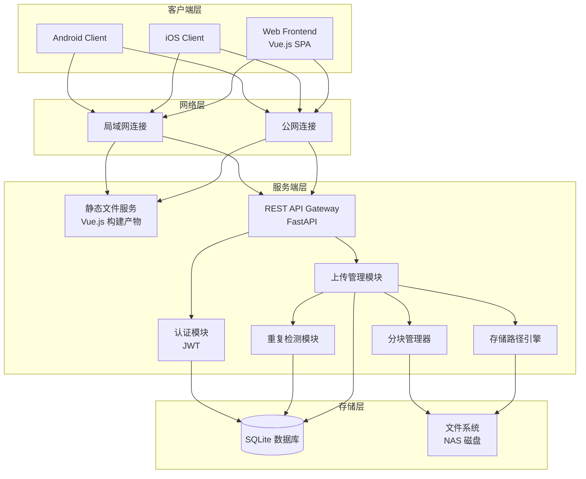
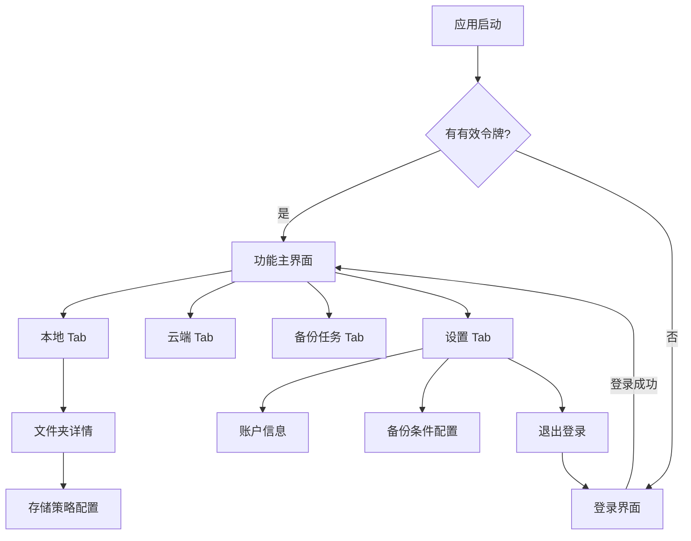
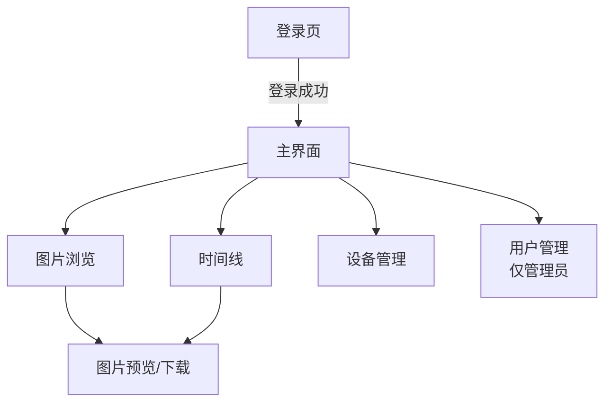
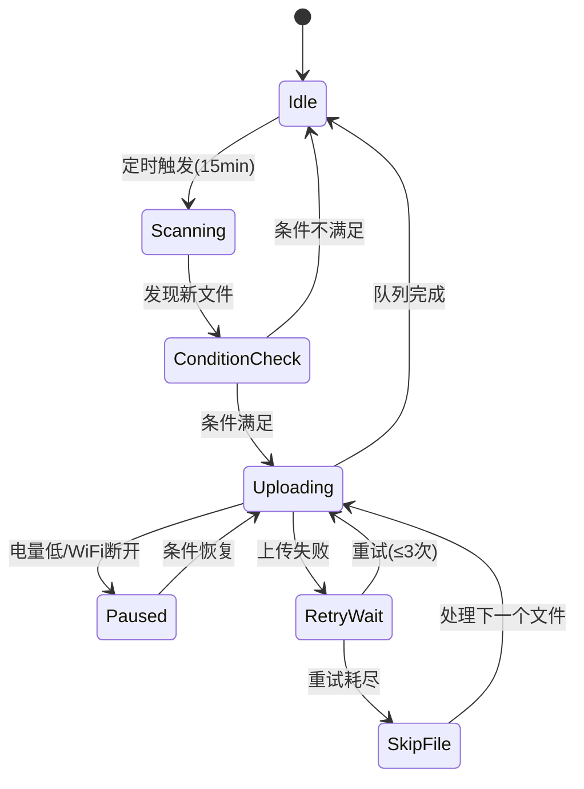

# 技术设计文档：手机图片备份系统

## 概述

本系统是一套手机图片备份解决方案，采用前后端分离架构。服务端使用 Python (FastAPI) 部署在 x86 Linux NAS 上，提供统一的 RESTful API 接口；客户端包括 Android、iOS 移动端和 Vue.js Web 前端，三端共用同一套 API。

系统核心能力包括：
- 公网/局域网双通道连接，优先局域网
- 原图无损备份，保留完整元数据
- 后台低功耗自动备份，条件触发
- 多用户隔离存储
- 基于分块的断点续传
- SHA-256 哈希重复检测
- 灵活的存储路径策略（正交选项组合）
- Web 端图片浏览与管理

## 架构

### 系统架构图



### 技术选型

| 组件 | 技术选择 | 理由 |
|------|----------|------|
| 服务端框架 | FastAPI | 异步支持好，性能优秀，自动生成 API 文档 |
| 反向代理/HTTPS | Caddy | 自动 HTTPS 证书管理，配置简单，适合自部署 |
| Web 前端 | Vue.js 3 + Vite | 轻量、响应式、生态成熟，构建产物可由 FastAPI 直接 serve |
| Web UI 库 | Element Plus | 组件丰富，适合管理类界面 |
| 数据库 | SQLite | 轻量级，无需额外部署，适合 NAS 场景 |
| 认证 | JWT (PyJWT) | 无状态认证，适合移动端和 Web 端 |
| 文件哈希 | SHA-256 | 安全性高，碰撞概率极低 |
| 图片处理 | Pillow + pillow-heif + rawpy | 覆盖 HEIC、RAW 等格式的缩略图生成 |
| 客户端网络 | Retrofit (Android) / URLSession (iOS) | 平台原生，支持断点续传 |
| 客户端存储 | Room (Android) / Core Data (iOS) | 平台推荐的持久化方案 |

### 通信协议

- 传输协议：HTTPS（通过 Caddy 反向代理，自动管理 TLS 证书）
- 局域网可选：HTTP 直连（纯内网部署时）
- API 风格：RESTful
- 数据格式：JSON（元数据）+ Binary（文件块）
- 认证方式：Bearer Token (JWT)

### 部署架构

```
┌─────────────────────────────────────────────┐
│  NAS (x86 Linux)                            │
│                                             │
│  ┌─────────┐      ┌──────────────────────┐  │
│  │  Caddy  │─────▶│  FastAPI (127.0.0.1) │  │
│  │ :443/:80│      │  :8000               │  │
│  └─────────┘      │  ├─ /api/v1/*        │  │
│       ▲           │  └─ /* (Vue.js SPA)  │  │
│       │           └──────────────────────┘  │
│  公网/局域网                                  │
└─────────────────────────────────────────────┘
```

- **Caddy**：负责 HTTPS 终止、自动证书管理、反向代理
- **FastAPI**：仅监听 localhost，serve API + Vue.js 静态文件
- **Caddyfile 模板**：用户只需修改域名即可部署

```
your-domain.com {
    reverse_proxy 127.0.0.1:8000
}
```

## 组件与接口

### 服务端组件

#### 1. API Gateway (FastAPI 应用)

负责路由分发、请求验证和响应格式化。

```python
# 核心 API 端点
POST   /api/v1/setup/init             # 首次部署引导（创建管理员）
GET    /api/v1/setup/status            # 检查是否已初始化

POST   /api/v1/auth/login              # 用户登录
POST   /api/v1/auth/refresh            # 刷新令牌
GET    /api/v1/connection/test          # 测试连接

POST   /api/v1/backup/check            # 重复检测
POST   /api/v1/backup/init             # 初始化上传任务
POST   /api/v1/backup/chunk            # 上传分块
POST   /api/v1/backup/complete         # 完成上传
GET    /api/v1/backup/resume/{file_id}  # 获取续传信息

GET    /api/v1/files/browse             # 浏览目录结构
GET    /api/v1/files/list               # 列出目录下的文件
GET    /api/v1/files/thumbnail/{file_id}  # 获取缩略图
GET    /api/v1/files/download/{file_id}   # 下载原图
GET    /api/v1/files/video/{file_id}      # 获取 Live Photo/动态照片视频流

GET    /api/v1/admin/users              # 用户管理（管理员）
POST   /api/v1/admin/users              # 创建用户
DELETE /api/v1/admin/users/{id}         # 删除用户
PUT    /api/v1/admin/users/{id}/password  # 修改密码
GET    /api/v1/admin/status             # 系统状态（存储路径、磁盘用量）
```

#### 2. 认证模块 (AuthService)

```python
class AuthService:
    def login(username: str, password: str) -> TokenPair
    def verify_token(token: str) -> UserInfo
    def refresh_token(refresh_token: str) -> TokenPair
    def create_user(username: str, password: str) -> User
    def delete_user(user_id: int) -> bool
    def change_password(user_id: int, new_password: str) -> bool
```

- 密码存储：bcrypt 哈希（cost factor = 12）
- 令牌有效期：access_token 24小时，refresh_token 7天
- 最大用户数：20

#### 3. 上传管理模块 (UploadService)

```python
class UploadService:
    def check_duplicate(user_id: int, file_hash: str, file_path: str) -> DuplicateCheckResult
    def init_upload(user_id: int, file_info: FileInfo) -> UploadSession
    def upload_chunk(session_id: str, chunk_index: int, data: bytes, checksum: str) -> ChunkResult
    def complete_upload(session_id: str) -> UploadResult
    def get_resume_info(user_id: int, file_id: str) -> ResumeInfo
```

#### 4. 存储路径引擎 (StoragePathEngine)

```python
class StoragePathEngine:
    def resolve_path(
        storage_root: str,
        username: str,
        device_name: str,
        source_folder: str,
        policy: StoragePolicy,
        file_metadata: FileMetadata
    ) -> str
    
    def validate_path(path: str) -> PathValidationResult
    def sanitize_device_name(name: str) -> str
```

路径解析规则（四种组合）：
1. 不手动指定 + 不按年月：`{root}/{user}/{device}/{source_folder}/`
2. 不手动指定 + 按年月：`{root}/{user}/{device}/{source_folder}/{year}/{month}/`
3. 手动指定 + 不按年月：`{custom_path}/{source_folder}/`
4. 手动指定 + 按年月：`{custom_path}/{source_folder}/{year}/{month}/`

#### 5. 分块管理器 (ChunkManager)

```python
class ChunkManager:
    CHUNK_SIZE = 2 * 1024 * 1024  # 2MB
    
    def create_session(file_id: str, total_chunks: int) -> str
    def store_chunk(session_id: str, chunk_index: int, data: bytes) -> bool
    def get_received_chunks(session_id: str) -> List[int]
    def merge_chunks(session_id: str) -> str  # 返回合并后文件路径
    def cleanup_session(session_id: str) -> None
```

#### 6. 重复检测模块 (DeduplicationService)

```python
class DeduplicationService:
    def check(user_id: int, file_hash: str) -> Optional[FileRecord]
    def create_reference(user_id: int, file_hash: str, target_path: str, source_record: FileRecord) -> FileRecord
    def register_file(user_id: int, file_hash: str, file_path: str, file_size: int) -> FileRecord
```

#### 7. 文件浏览服务 (FileBrowseService)

```python
class FileBrowseService:
    def list_directory(user_id: int, path: str) -> DirectoryListing
    def get_file_info(user_id: int, file_id: int) -> FileDetail
    def get_thumbnail(user_id: int, file_id: int, size: ThumbnailSize) -> bytes
    def get_original(user_id: int, file_id: int) -> StreamingResponse
    def search_files(user_id: int, query: str, filters: SearchFilters) -> List[FileRecord]
```

**目录浏览接口说明：**

```python
# 浏览目录结构
# GET /api/v1/files/browse?path=/DCIM/Camera
class DirectoryListing(BaseModel):
    current_path: str
    parent_path: Optional[str]
    directories: List[DirectoryInfo]   # 子目录列表
    files: List[FileInfo]              # 当前目录下的文件
    total_files: int
    page: int
    page_size: int

class DirectoryInfo(BaseModel):
    name: str
    path: str
    file_count: int                    # 该目录下的文件总数（含子目录）
    latest_file_time: Optional[str]    # 最新文件的时间

class FileBrowseInfo(BaseModel):
    id: int
    file_name: str
    file_size: int
    mime_type: str
    exif_time: Optional[str]
    thumbnail_url: str                 # 缩略图 URL
    created_at: str
```

**缩略图生成策略：**
- 首次请求时生成缩略图并缓存到 `{Storage_Root}/.thumbnails/{user}/` 目录
- 缩略图尺寸：小图 200x200（列表用）、中图 600x600（预览用）
- 使用 Pillow 库生成，保持宽高比，居中裁剪
- 缩略图文件名：`{file_hash}_{size}.jpg`
- RAW 格式：优先提取嵌入预览图，无预览时使用 rawpy 解码
- HEIC/HEIF：使用 pillow-heif 插件解码

**支持的文件格式：**

| 类别 | 格式 | 缩略图生成方式 |
|------|------|---------------|
| 通用图片 | JPEG, PNG, WebP, GIF, BMP, TIFF | Pillow 直接处理 |
| 手机格式 | HEIC/HEIF, AVIF | pillow-heif / pillow-avif 插件 |
| 相机 RAW | DNG, CR2, CR3, NEF, ARW, ORF, RAF, RW2 | rawpy 解码或提取嵌入预览 |
| 动态内容 | Live Photo (HEIC+MOV), Motion Photo (嵌入视频) | 图片部分生成缩略图 |

**Live Photo / 动态照片处理：**

```python
class LivePhotoService:
    def detect_live_photo(file_path: str, associated_files: List[str]) -> Optional[LivePhotoGroup]
    def extract_motion_video(motion_photo_path: str) -> Optional[bytes]  # Android Motion Photo
    def get_video_stream(file_id: int) -> StreamingResponse
```

- **iPhone Live Photo**：HEIC/JPEG 图片 + 同名 MOV 文件，通过文件名关联（如 IMG_001.HEIC + IMG_001.MOV）
- **Android Motion Photo**：视频数据嵌入在图片文件尾部，通过 XMP 元数据中的 `GCamera:MotionPhoto` 标记识别
- 数据库中通过 `live_photo_group_id` 字段关联图片和视频文件
- Web/移动端展示时，悬浮或长按触发视频播放

**服务端配置文件 (config.yaml)：**

```yaml
server:
  host: "127.0.0.1"
  port: 8000

storage:
  root: "/data/photovault"  # 用户可自定义

auth:
  access_token_expire_hours: 24
  refresh_token_expire_days: 7
  max_users: 20

backup:
  chunk_size_mb: 2
  session_expire_days: 7
```

### 客户端交互设计

#### 整体导航结构



#### 登录界面

**布局结构：**
- 顶部：应用 Logo + 名称
- 中部：表单区域
  - 服务器地址输入框（placeholder: `192.168.1.100:8080`）
  - 用户名输入框
  - 密码输入框（带显示/隐藏切换按钮）
  - "记住密码"复选框
- 底部：操作按钮区域
  - "测试连接"按钮（次要样式，点击后显示加载动画，10秒内返回结果）
  - "登录"按钮（主要样式，全宽）

**交互流程：**
1. 启动时检查本地是否有保存的凭证，有则自动填充
2. 用户输入服务器地址后可点击"测试连接"验证网络可达性
3. 测试连接结果以 Toast/Snackbar 形式显示（✓ 连接成功 / ✗ 连接失败 + 原因）
4. 点击"登录"前验证三个字段非空，空字段高亮红色边框并显示提示文字
5. 登录过程中按钮显示加载状态，禁止重复点击
6. 登录失败在表单上方显示红色错误横幅（如"用户名或密码错误"、"服务器不可达"）

#### 功能主界面 — 本地 Tab

**布局结构：**
- 顶部状态栏：连接状态指示（绿色圆点=已连接/灰色=未连接）+ 连接方式（局域网/公网）
- 内容区：文件夹列表（卡片式）
  - 每个卡片显示：文件夹名称、图片总数、已备份数、备份进度百分比
  - 右侧显示备份状态图标（✓ 全部已备份 / ⟳ 备份中 / ⚠ 有待备份）
- 底部：添加备份文件夹按钮（FAB 浮动按钮）

**交互流程：**
1. 点击文件夹卡片 → 进入文件夹详情页，显示该文件夹下的图片缩略图网格
2. 图片缩略图右下角显示备份状态小图标（✓ 已备份 / 待备份无标记）
3. 点击 FAB → 打开系统文件夹选择器，选择要备份的文件夹
4. 选择文件夹后 → 弹出存储策略配置底部弹窗
5. 长按文件夹卡片 → 显示操作菜单（配置策略 / 移除备份文件夹）

#### 功能主界面 — 云端 Tab

**布局结构：**
- 顶部：路径面包屑导航（如 `/ > alice > Pixel9Pro > DCIM`）
- 内容区：文件/文件夹列表
  - 文件夹显示：文件夹图标 + 名称 + 文件数量
  - 文件显示：缩略图 + 文件名 + 大小 + 备份时间
- 空状态：显示引导文案"还没有备份文件，去本地 Tab 添加备份文件夹吧"

**交互流程：**
1. 点击文件夹 → 进入子目录，面包屑更新
2. 点击面包屑中的任意层级 → 跳转到对应目录
3. 点击文件 → 全屏预览图片
4. 下拉刷新 → 重新加载当前目录内容

#### 功能主界面 — 备份任务 Tab

**布局结构：**
- 顶部：分段控制器（当前任务 / 历史记录）
- 当前任务视图：
  - 正在上传的文件：文件名 + 进度条 + 速度 + 剩余时间
  - 排队中的文件列表：文件名 + 文件大小 + 等待状态
  - 暂停状态提示：暂停原因（电量不足/WiFi断开）+ 恢复条件
- 历史记录视图：
  - 按日期分组的备份记录列表
  - 每条记录：文件名 + 大小 + 备份时间 + 状态（成功/失败/跳过）
  - 失败记录可点击重试

**交互流程：**
1. 正在上传时显示实时进度和传输速度
2. 暂停状态下显示恢复条件提示（如"将在 WiFi 连接后自动恢复"）
3. 点击失败记录 → 显示失败原因 + "重试"按钮
4. 历史记录支持按状态筛选（全部/成功/失败）

#### 功能主界面 — 设置 Tab

**布局结构：**
- 分组列表形式：
  - **备份条件**组：
    - WiFi 开关（默认开启，不可关闭 — 仅 WiFi 下备份）
    - 最低电量滑块（默认 50%，范围 20%-80%）
    - 扫描间隔（默认 15 分钟，可选 5/15/30/60 分钟）
  - **存储策略管理**组：
    - 已配置的文件夹列表，点击可修改策略
  - **账户信息**组：
    - 当前用户名
    - 服务器地址
    - 连接状态
  - **操作**组：
    - 退出登录按钮（红色文字）

#### 存储策略配置弹窗

**布局结构（底部弹窗 BottomSheet）：**
- 标题：`配置存储策略 — {文件夹名}`
- 选项区域：
  - Switch 1：手动指定存储目录（默认关闭）
    - 开启后展开：目标路径输入框 + 路径验证状态
  - Switch 2：按年月分层（默认关闭）
- 路径预览区域：
  - 实时显示根据当前选项组合生成的示例路径
  - 如：`/data/alice/Pixel9Pro/DCIM/Camera/2026/03/`
- 底部：保存按钮

**交互流程：**
1. 切换任一 Switch → 路径预览实时更新
2. 开启"手动指定"→ 展开路径输入框，输入时实时验证字符合法性
3. 路径不合法时输入框变红 + 显示错误提示（如"包含非法字符"）
4. 点击保存 → 如果开启了手动指定，先向服务端验证路径可用性
5. 验证通过 → 保存配置，关闭弹窗
6. 验证失败 → 显示错误提示，不关闭弹窗

#### 状态指示设计

| 状态 | 视觉表现 | 位置 |
|------|----------|------|
| 已连接(局域网) | 绿色圆点 + "局域网" | 顶部状态栏 |
| 已连接(公网) | 绿色圆点 + "公网" | 顶部状态栏 |
| 未连接 | 灰色圆点 + "未连接" | 顶部状态栏 |
| 备份中 | 蓝色旋转图标 | 文件夹卡片 |
| 已暂停 | 黄色暂停图标 | 备份任务页 |
| 备份完成 | 绿色对勾 | 文件缩略图 |
| 备份失败 | 红色感叹号 | 历史记录 |

### Web 前端设计

#### 技术架构

- **框架**：Vue.js 3 (Composition API) + Vue Router + Pinia
- **构建工具**：Vite
- **UI 组件库**：Element Plus
- **HTTP 客户端**：Axios
- **部署方式**：构建为静态文件，由 FastAPI 通过 `StaticFiles` 中间件直接 serve，无需额外 Web 服务器

```python
# FastAPI 中 serve Vue.js 构建产物
from fastapi.staticfiles import StaticFiles

app.mount("/", StaticFiles(directory="web/dist", html=True), name="web")
```

#### 页面结构



#### 登录页

- 居中卡片式布局，包含用户名、密码输入框和登录按钮
- 支持"记住登录状态"（将 JWT 存入 localStorage）
- 登录成功后跳转到图片浏览页

#### 图片浏览页（主页）

- **左侧边栏**：目录树导航（设备 → 文件夹层级）
- **右侧内容区**：
  - 顶部工具栏：路径面包屑 + 视图切换（网格/列表）+ 排序选项
  - 图片网格：缩略图展示，悬浮显示文件名和大小
  - 分页/无限滚动加载
- **图片预览**：点击图片弹出 Lightbox，支持左右切换、缩放、下载原图

#### 时间线页

- 按年月分组展示所有备份图片
- 左侧时间轴导航，点击快速跳转
- 支持按日期范围筛选

#### 设备管理页

- 展示当前用户的所有备份设备
- 每个设备卡片显示：设备名、备份文件数、占用空间、最后备份时间
- 点击设备进入该设备的文件浏览

#### 用户管理页（仅管理员可见）

- 用户列表：用户名、创建时间、备份文件数、占用空间
- 操作：创建用户、删除用户、重置密码

#### Web 前端与 API 的关系

Web 前端与移动客户端共用完全相同的 API 端点，不需要额外的后端接口。主要使用的 API：

| Web 页面 | 使用的 API |
|----------|-----------|
| 初始化引导 | `POST /api/v1/setup/init` |
| 登录 | `POST /api/v1/auth/login` |
| 图片浏览 | `GET /api/v1/files/browse`, `GET /api/v1/files/list` |
| 缩略图 | `GET /api/v1/files/thumbnail/{file_id}` |
| 原图下载 | `GET /api/v1/files/download/{file_id}` |
| Live Photo 视频 | `GET /api/v1/files/video/{file_id}` |
| 文件上传 | `POST /api/v1/backup/check`, `POST /api/v1/backup/init`, `POST /api/v1/backup/chunk`, `POST /api/v1/backup/complete` |
| 用户管理 | `GET/POST/DELETE /api/v1/admin/users` |
| 系统状态 | `GET /api/v1/admin/status`（Storage_Root 路径、磁盘用量） |

#### 初始化引导页

- 首次部署时（数据库无用户），所有请求重定向到引导页
- 引导页要求设置管理员用户名和密码（密码 ≥ 8 字符）
- 可选配置 Storage_Root 路径
- 完成后自动跳转到登录页

#### Web 端上传功能

- **上传入口**：图片浏览页顶部工具栏的"上传"按钮
- **上传方式**：拖拽区域 + 文件选择器，支持多文件批量选择
- **上传配置**：选择目标路径 + 是否按年月分层
- **上传流程**：与移动端一致（SHA-256 去重检测 → 分块上传 → 完成验证）
- **进度展示**：底部浮动面板显示上传队列、单文件进度条、整体进度
- **大文件支持**：使用 Web Worker 计算 SHA-256，避免阻塞 UI

### 客户端组件（移动端）

#### 1. 连接管理器 (ConnectionManager)

```
interface ConnectionManager {
    fun connect(serverAddress: String): ConnectionResult
    fun testConnection(serverAddress: String): TestResult
    fun getConnectionType(): ConnectionType  // LAN or WAN
}
```

连接策略：
1. 先尝试局域网地址（10秒超时）
2. 局域网失败后尝试公网地址（15秒超时）
3. 均失败则报错，等待下次 Backup_Condition 满足时重试

#### 2. 后台扫描服务 (BackgroundScanService)

```
interface BackgroundScanService {
    fun startPeriodicScan(interval: Duration = 15.minutes)
    fun scanSourceFolders(): List<NewFile>
    fun checkBackupCondition(): Boolean  // 电量>50% && WiFi
}
```

#### 3. 备份任务管理器 (BackupTaskManager)

```
interface BackupTaskManager {
    fun enqueueFiles(files: List<FileInfo>)
    fun pauseCurrentTask(reason: PauseReason)
    fun resumeTask()
    fun getTaskStatus(): TaskStatus
    fun getHistory(): List<BackupRecord>
}
```

#### 4. 分块传输器 (ChunkUploader)

```
interface ChunkUploader {
    fun splitFile(file: File): List<Chunk>
    fun uploadChunk(chunk: Chunk): ChunkUploadResult
    fun getResumePoint(fileId: String): Int  // 返回下一个待传输的 chunk index
    fun saveProgress(fileId: String, chunkIndex: Int)
}
```

#### 5. 策略配置管理器 (PolicyConfigManager)

```
interface PolicyConfigManager {
    fun getPolicy(sourceFolder: String): StoragePolicy
    fun savePolicy(sourceFolder: String, policy: StoragePolicy)
    fun getAllPolicies(): Map<String, StoragePolicy>
}
```

## 数据模型

### 服务端数据库模型

```sql
-- 用户表
CREATE TABLE users (
    id INTEGER PRIMARY KEY AUTOINCREMENT,
    username TEXT UNIQUE NOT NULL,
    password_hash TEXT NOT NULL,
    is_admin BOOLEAN DEFAULT FALSE,
    created_at TIMESTAMP DEFAULT CURRENT_TIMESTAMP
);

-- 文件记录表
CREATE TABLE file_records (
    id INTEGER PRIMARY KEY AUTOINCREMENT,
    user_id INTEGER NOT NULL,
    file_hash TEXT NOT NULL,
    file_path TEXT NOT NULL,          -- NAS 上的存储路径
    original_path TEXT NOT NULL,       -- 手机上的原始路径
    device_name TEXT NOT NULL,
    file_size INTEGER NOT NULL,
    file_name TEXT NOT NULL,
    mime_type TEXT,
    exif_time TIMESTAMP,              -- EXIF 拍摄时间
    is_reference BOOLEAN DEFAULT FALSE, -- 是否为引用（去重）
    reference_to INTEGER,              -- 引用的原始文件 ID
    live_photo_group_id TEXT,          -- Live Photo/动态照片分组 ID
    live_photo_type TEXT,              -- 'image' | 'video' | NULL
    media_type TEXT DEFAULT 'image',   -- 'image' | 'raw' | 'video' | 'motion_photo'
    created_at TIMESTAMP DEFAULT CURRENT_TIMESTAMP,
    FOREIGN KEY (user_id) REFERENCES users(id),
    FOREIGN KEY (reference_to) REFERENCES file_records(id),
    UNIQUE(user_id, file_hash, file_path)
);

-- 上传会话表（断点续传）
CREATE TABLE upload_sessions (
    id TEXT PRIMARY KEY,               -- UUID
    user_id INTEGER NOT NULL,
    file_hash TEXT NOT NULL,
    file_name TEXT NOT NULL,
    file_size INTEGER NOT NULL,
    total_chunks INTEGER NOT NULL,
    received_chunks TEXT DEFAULT '[]',  -- JSON 数组，已接收的 chunk 序号
    target_path TEXT NOT NULL,
    device_name TEXT NOT NULL,
    original_path TEXT NOT NULL,
    status TEXT DEFAULT 'active',      -- active, completed, expired
    created_at TIMESTAMP DEFAULT CURRENT_TIMESTAMP,
    updated_at TIMESTAMP DEFAULT CURRENT_TIMESTAMP,
    expires_at TIMESTAMP NOT NULL,     -- 7天后过期
    FOREIGN KEY (user_id) REFERENCES users(id)
);

-- 哈希索引表（加速重复检测）
CREATE INDEX idx_file_hash ON file_records(user_id, file_hash);
CREATE INDEX idx_upload_session_user ON upload_sessions(user_id, file_hash);
```

### 客户端数据模型

```kotlin
// 备份记录
data class BackupRecord(
    val id: Long,
    val filePath: String,           // 本地文件路径
    val fileHash: String,           // SHA-256 哈希
    val fileSize: Long,
    val status: BackupStatus,       // PENDING, UPLOADING, COMPLETED, FAILED
    val uploadedChunks: Int,        // 已上传的分块数
    val totalChunks: Int,
    val lastModified: Long,         // 文件修改时间
    val createdAt: Long,
    val retryCount: Int,            // 重试次数
    val errorMessage: String?
)

// 存储策略
data class StoragePolicy(
    val sourceFolder: String,       // 源文件夹路径
    val useCustomPath: Boolean,     // 是否手动指定目录
    val customPath: String?,        // 手动指定的目标路径
    val useYearMonthLayer: Boolean  // 是否按年月分层
)

// 连接配置
data class ConnectionConfig(
    val serverAddress: String,
    val username: String,
    val passwordEncrypted: String?, // 加密存储的密码（记住密码时）
    val rememberPassword: Boolean
)

// 扫描状态
data class ScanState(
    val sourceFolder: String,
    val lastScanTime: Long,
    val lastFileTimestamp: Long     // 上次扫描到的最新文件时间
)
```

### API 数据传输对象

```python
# 登录请求/响应
class LoginRequest(BaseModel):
    username: str
    password: str

class LoginResponse(BaseModel):
    access_token: str
    refresh_token: str
    expires_in: int  # 秒

# 重复检测
class DuplicateCheckRequest(BaseModel):
    file_hash: str
    file_path: str
    device_name: str

class DuplicateCheckResponse(BaseModel):
    is_duplicate: bool
    file_id: Optional[str]

# 初始化上传
class InitUploadRequest(BaseModel):
    file_hash: str
    file_name: str
    file_size: int
    file_path: str          # 手机上的原始路径
    device_name: str
    source_folder: str
    storage_policy: StoragePolicyDTO
    exif_time: Optional[str]
    file_modified_time: str

class StoragePolicyDTO(BaseModel):
    use_custom_path: bool
    custom_path: Optional[str]
    use_year_month_layer: bool

class InitUploadResponse(BaseModel):
    session_id: str
    total_chunks: int
    chunk_size: int

# 分块上传
class ChunkUploadResponse(BaseModel):
    chunk_index: int
    received: bool
    checksum_valid: bool

# 完成上传
class CompleteUploadResponse(BaseModel):
    success: bool
    file_id: str
    integrity_valid: bool
    stored_path: str

# 续传信息
class ResumeInfoResponse(BaseModel):
    session_id: str
    received_chunks: List[int]
    total_chunks: int
    file_hash: str
    expires_at: str
```

## 正确性属性

*正确性属性是在系统所有有效执行中都应成立的特征或行为——本质上是关于系统应该做什么的形式化陈述。属性是人类可读规范与机器可验证正确性保证之间的桥梁。*

### Property 1: 文件分块与合并的往返一致性

*对于任意*大小的文件数据，将其按 2MB 分块后再合并，得到的结果应与原始文件数据完全一致（字节级相同，SHA-256 哈希匹配）。

**Validates: Requirements 2.1, 2.2, 2.3, 5.1, 5.5**

### Property 2: 存储路径引擎的四种组合正确性

*对于任意*有效的用户名、设备名、源文件夹路径、自定义路径和文件时间，存储路径引擎应根据 Storage_Policy 的四种组合生成正确的路径：
- 不手动指定 + 不按年月：`{root}/{user}/{device}/{source_folder}/`
- 不手动指定 + 按年月：`{root}/{user}/{device}/{source_folder}/{YYYY}/{MM}/`
- 手动指定 + 不按年月：`{custom_path}/{source_folder}/`
- 手动指定 + 按年月：`{custom_path}/{source_folder}/{YYYY}/{MM}/`

**Validates: Requirements 9.1, 10.2, 11.2, 11.4, 12.2**

### Property 3: 设备名称净化

*对于任意*字符串作为设备名称输入，净化后的输出应仅包含字母、数字、下划线和连字符，且所有不合法字符均被替换为下划线。

**Validates: Requirements 7.3**

### Property 4: 路径验证拒绝非法输入

*对于任意*路径字符串，如果其中包含文件系统不支持的字符、单个文件夹名称超过 255 字符、或完整路径超过 4096 字符，存储路径引擎应拒绝该路径并返回明确的错误信息。

**Validates: Requirements 9.3, 9.4, 10.1**

### Property 5: 重复检测的幂等性

*对于任意*已注册的文件哈希值，无论检测请求发送多少次、从哪个路径发起，系统都应正确识别为重复文件。当路径不同时，应创建引用而非重复存储文件内容。

**Validates: Requirements 6.3, 6.6**

### Property 6: 用户存储隔离

*对于任意*两个不同的用户 A 和 B，用户 A 的任何文件操作请求都不应能访问用户 B 的备份文件，且用户 A 的所有备份文件路径都应包含用户 A 的用户名目录。

**Validates: Requirements 4.4, 4.5, 7.1**

### Property 7: 无效认证始终被拒绝

*对于任意*不存在的用户名、错误的密码、过期的令牌或格式错误的令牌，系统应拒绝请求并返回通用错误信息（不透露具体失败原因）。

**Validates: Requirements 4.3, 4.6**

### Property 8: 断点续传的正确恢复

*对于任意*文件和任意中断点（chunk 序号），如果文件在中断后未被修改（大小和修改时间一致）且距中断不超过 7 天，恢复传输时应从中断点继续，不重传已确认的分块。

**Validates: Requirements 5.3, 5.4, 5.7**

### Property 9: 文件备份队列按时间排序

*对于任意*一组新检测到的待备份文件，备份队列中的文件顺序应严格按照文件创建时间从早到晚排列。

**Validates: Requirements 3.3**

### Property 10: 年月时间提取优先级

*对于任意*图片文件，当启用年月分层时：若文件包含 EXIF 拍摄时间，应使用 EXIF 时间；若无 EXIF 时间但有文件创建时间，应使用文件创建时间；若两者都无，应归入 `unknown_date` 目录。时间格式始终为 4 位年份和 2 位零填充月份。

**Validates: Requirements 11.1, 11.5**

### Property 11: 同名文件冲突解决

*对于任意*目标目录下已存在的同名文件，如果新文件内容与已有文件相同（哈希一致），应跳过存储；如果内容不同，应在文件名后追加数字后缀（如 `_1`, `_2`）后存储，确保不覆盖已有文件。

**Validates: Requirements 11.6**

### Property 12: 存储策略配置的持久化往返

*对于任意*有效的 StoragePolicy 配置（包含 source_folder、use_custom_path、custom_path、use_year_month_layer），保存后重新加载应得到完全相同的配置值。

**Validates: Requirements 8.4, 12.4**

### Property 13: 存储策略选项正交独立性

*对于任意*初始策略状态，修改"是否手动指定目录"选项时，"是否按年月分层"选项的值应保持不变；反之亦然。

**Validates: Requirements 8.3, 12.3**

### Property 14: 登录表单非空验证

*对于任意*三个输入字段（服务器地址、用户名、密码）的组合，只要其中任何一个字段为空字符串或纯空白字符串，登录请求应被阻止并提示用户填写。

**Validates: Requirements 13.6**

### Property 15: 分块大小正确性

*对于任意*大小的文件，分块后每个 chunk 的大小应恰好为 2MB，最后一个 chunk 的大小应等于 `file_size % (2MB)`（若整除则为 2MB），且 chunk 总数应等于 `ceil(file_size / 2MB)`。

**Validates: Requirements 5.1**

## 错误处理

### 服务端错误处理策略

| 错误类型 | HTTP 状态码 | 处理方式 |
|----------|-------------|----------|
| 认证失败 | 401 | 返回通用错误信息，不透露具体原因 |
| 令牌过期 | 401 | 返回令牌无效提示，要求重新登录 |
| 权限不足 | 403 | 拒绝访问，记录日志 |
| 文件不存在 | 404 | 返回资源未找到 |
| 路径验证失败 | 400 | 返回具体的验证错误信息 |
| 磁盘空间不足 | 507 | 拒绝备份任务，返回空间不足提示 |
| 目录创建失败 | 500 | 返回失败原因（权限/空间） |
| 文件完整性校验失败 | 422 | 丢弃文件，通知客户端重传 |
| 分块校验失败 | 422 | 拒绝该分块，要求重传 |
| 服务器内部错误 | 500 | 记录详细日志，返回通用错误 |

### 客户端错误处理策略

| 场景 | 处理方式 |
|------|----------|
| 连接超时（局域网 10s） | 自动切换到公网连接 |
| 连接超时（公网 15s） | 显示错误，等待下次条件满足重试 |
| 上传失败 | 重试 3 次（间隔 30s），仍失败则跳过 |
| 电量不足 | 暂停任务，记录进度，电量恢复后继续 |
| WiFi 断开 | 暂停任务，记录进度，WiFi 恢复后继续 |
| 重复检测超时（30s） | 视为未备份，正常上传 |
| 续传记录过期（>7天） | 废弃记录，重新传输 |
| 源文件已修改 | 废弃续传记录，重新传输 |
| 登录失败 | 显示具体错误原因，停留在登录页 |

### 错误恢复机制



## 测试策略

### 测试分层

#### 1. 属性测试（Property-Based Testing）

使用 **Hypothesis**（Python 服务端）进行属性测试，每个属性测试最少运行 100 次迭代。

重点覆盖：
- 存储路径引擎的路径解析逻辑（Property 2, 3, 4）
- 文件分块与合并的往返一致性（Property 1, 15）
- 重复检测逻辑（Property 5）
- 用户隔离验证（Property 6）
- 认证拒绝逻辑（Property 7）
- 断点续传恢复逻辑（Property 8）
- 时间提取与格式化（Property 10）
- 同名文件冲突解决（Property 11）
- 策略配置持久化（Property 12, 13）
- 输入验证（Property 14）

每个属性测试必须标注对应的设计属性：
```python
# Feature: photo-backup-service, Property 2: 存储路径引擎的四种组合正确性
@given(st.text(), st.text(), st.text(), st.text(), st.datetimes())
def test_storage_path_combinations(user, device, source, custom, dt):
    ...
```

#### 2. 单元测试

覆盖具体示例和边界情况：
- 连接优先级逻辑（局域网优先、超时切换）
- 备份条件判断（电量、WiFi）
- 重试机制（3次重试、30秒间隔）
- 登录界面验证
- Tab 页导航
- 默认配置值

#### 3. 集成测试

覆盖组件间交互：
- 完整的上传流程（初始化 → 分块上传 → 完成）
- 断点续传完整流程（上传 → 中断 → 恢复 → 完成）
- 认证流程（登录 → 获取令牌 → 使用令牌 → 令牌过期 → 刷新）
- 目录自动创建
- 后台扫描与备份触发

#### 4. 端到端测试

覆盖完整用户场景：
- 新用户首次备份完整流程
- 多设备备份到同一账户
- 网络切换场景下的备份恢复
- 策略变更后的新文件备份

### 测试工具

| 层级 | 服务端 | 客户端 (Android) | 客户端 (iOS) | Web 前端 |
|------|--------|-----------------|--------------|----------|
| 属性测试 | Hypothesis | - | - | - |
| 单元测试 | pytest | JUnit 5 + Mockk | XCTest | Vitest |
| 集成测试 | pytest + httpx | Espresso | XCUITest | Cypress |
| 端到端 | pytest + Docker | Appium | Appium | Cypress |

### 关键测试场景

1. **路径引擎测试**：生成随机的用户名、设备名、源路径、自定义路径和时间，验证所有 4 种策略组合的路径输出
2. **分块传输测试**：生成随机大小的文件（1B ~ 100MB），验证分块、传输、合并后的完整性
3. **重复检测测试**：生成随机文件哈希，注册后再次检测，验证幂等性
4. **并发测试**：模拟多用户同时上传，验证数据隔离和无竞态条件

