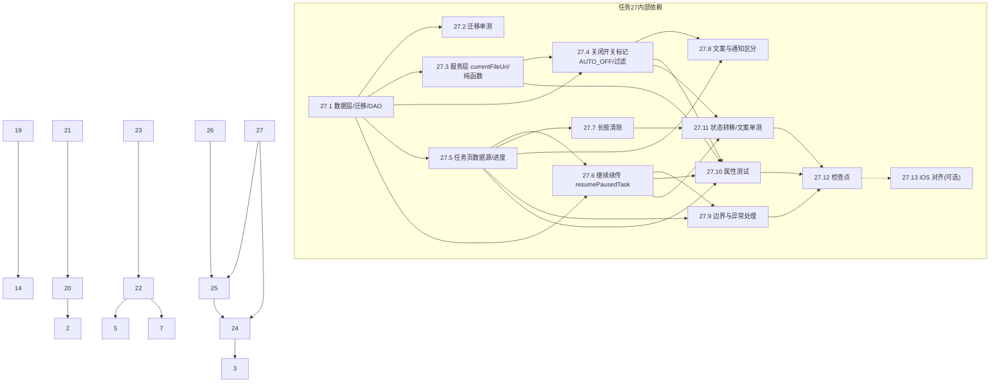

# Implementation Plan

## Overview

手机图片备份系统 - 包含 Python 服务端(FastAPI)、Vue.js Web 前端、Android 客户端和 iOS 客户端的完整图片备份解决方案。

## Tasks

- [x] 1. 项目初始化与基础结构搭建
  - [x] 1.1 创建 Python 项目结构（server/ 目录），初始化 FastAPI 应用
  - [x] 1.2 配置 pyproject.toml / requirements.txt
  - [x] 1.3 创建配置管理模块和 SQLite 数据库初始化
  - [x] 1.4 实现数据库连接池、日志配置、Dockerfile

- [x] 2. 认证模块实现
  - [x] 2.1 实现 AuthService 类和 JWT 令牌管理
  - [x] 2.2 实现 API 端点（login, refresh, test, admin users）
  - [x] 2.3 实现用户管理和权限控制

- [x] 3. 存储路径引擎实现
  - [x] 3.1 实现 StoragePathEngine 类及四种路径组合逻辑
  - [x] 3.2 实现设备名净化、路径验证和路径验证 API

- [x] 4. 重复检测模块实现
  - [x] 4.1 实现 DeduplicationService 类（check, register_file, create_reference）
  - [x] 4.2 实现 API 端点 POST /api/v1/backup/check

- [x] 5. 分块管理器与断点续传实现
  - [x] 5.1 实现 ChunkManager 类（create_session, store_chunk, merge_chunks）
  - [x] 5.2 实现分块校验、过期会话清理
  - [x] 5.3 实现 API 端点（init, chunk, complete, resume）

- [x] 6. 上传管理模块（整合流程）
  - [x] 6.1 实现 UploadService 整合重复检测、分块管理、存储路径引擎
  - [x] 6.2 实现同名文件冲突解决和磁盘空间检查

- [x] 7. 文件浏览服务实现
  - [x] 7.1 实现 FileBrowseService 类（目录浏览、缩略图生成、原图下载）
  - [x] 7.2 实现 API 端点（browse, list, thumbnail, download）

- [x] 8. Web 前端项目初始化
  - [x] 8.1 创建 Vue.js 3 项目并安装依赖
  - [x] 8.2 配置路由、Axios 拦截器、Pinia store

- [x] 9. Web 登录页实现
  - [x] 9.1 实现居中卡片式登录表单和登录逻辑

- [x] 10. Web 图片浏览页实现
  - [x] 10.1 实现目录树导航和图片网格/列表视图
  - [x] 10.2 实现图片预览 Lightbox 和原图下载

- [x] 11. Web 时间线页实现
  - [x] 11.1 实现按年月分组的图片展示和时间轴导航

- [x] 12. Web 设备管理与用户管理页实现
  - [x] 12.1 实现设备管理页和用户管理页（管理员）

- [x] 13. Android 项目初始化与登录界面
  - [x] 13.1 创建 Android 项目并实现登录界面

- [x] 14. Android 功能主界面框架（四个 Tab）
  - [x] 14.1 实现底部导航栏和连接管理器

- [x] 15. Android 本地 Tab 与存储策略配置
  - [x] 15.1 实现文件夹列表和存储策略配置

- [x] 16. Android 后台扫描与备份条件检测
  - [x] 16.1 实现 BackgroundScanService 和备份条件检测

- [x] 17. Android 分块上传与断点续传
  - [x] 17.1 实现 ChunkUploader 和断点续传逻辑

- [x] 18. Android 云端 Tab 与备份任务 Tab
  - [x] 18.1 实现云端浏览和备份任务管理界面

- [x] 19. Android 设置 Tab 完善
  - [x] 19.1 实现存储策略管理组：已配置文件夹列表，点击修改策略
  - [x] 19.2 实现账户信息组：当前用户名、服务器地址、连接状态
  - [x] 19.3 实现退出登录按钮：清除令牌，跳转登录页

- [x] 20. iOS 项目初始化与登录界面
  - [x] 20.1 创建 iOS 项目（ios/ 目录），使用 Swift + SwiftUI
  - [x] 20.2 配置依赖：URLSession, Core Data, BackgroundTasks framework
  - [x] 20.3 实现登录界面（服务器地址、用户名、密码、测试连接、记住密码）
  - [x] 20.4 实现 Keychain 加密存储凭证和 JWT 令牌管理
  - [x] 20.5 实现自动登录

- [x] 21. iOS 功能主界面与后台备份
  - [x] 21.1 实现 TabView 底部导航（本地、云端、备份任务、设置）和连接管理器
  - [x] 21.2 实现后台扫描（BGAppRefreshTask + BGProcessingTask）和 PHPhotoLibrary 监听
  - [x] 21.3 实现备份条件检测和分块上传与断点续传
  - [x] 21.4 实现本地 Tab：文件夹列表、存储策略配置 Sheet
  - [x] 21.5 实现云端 Tab：目录浏览、图片预览
  - [x] 21.6 实现备份任务 Tab：当前任务/历史记录
  - [x] 21.7 实现设置 Tab

- [x] 22. 服务端测试套件
  - [x] 22.1 实现属性测试（Hypothesis）：存储路径引擎、设备名净化、路径验证、重复检测、用户隔离、认证拒绝、断点续传、年月时间提取、同名文件冲突、分块大小
  - [x] 22.2 实现集成测试（pytest + httpx）：完整上传流程、断点续传、认证流程、多用户并发
  - [x] 22.3 实现性能测试：模拟 5 个用户同时上传 100MB 文件

- [x] 23. 部署与运维配置
  - [x] 23.1 完善 Dockerfile 多阶段构建和 docker-compose.yml 数据卷映射
  - [x] 23.2 实现 HTTPS 支持（自签名证书生成脚本 + Let's Encrypt 配置指南）
  - [x] 23.3 实现首次启动向导：创建管理员账户、配置 storage_root
  - [x] 23.4 编写部署文档（README.md）
  - [x] 23.5 实现过期会话定时清理和磁盘空间监控告警

- [x] 24. 修复：运行中关闭"自动备份"仅停止自动任务（Android）
  - [x] 24.1 为 `BackupForegroundService.start` 增加 `manual: Boolean` 参数，经 Intent extra `KEY_MANUAL_RUN` 传入并保存为 `isManualRun`；更新所有调用方（`doBackupNow`/单张重新备份/任务页重试传 `manual=true`，`BackgroundScanWorker`/`ConditionCheckWorker` 传 `manual=false`）
  - [x] 24.2 新增 `BackupForegroundService.stopAuto`（停止服务并将来源标记复位）；在 `SettingsViewModel.setAutoBackupEnabled(false)` 中：服务运行且 `isManualRun` 为真则不动，否则停止服务并 `backupQueue.clear()`
  - [x] 24.3 校验断点续传：被清空/停止时保留正在上传文件的 `UploadRecord`，确保开关重新开启后可从断点续传
  - _Requirements: 3.13, 3.14, 3.15_

- [x] 25. 备份任务的手动开始/暂停控制（Android）
  - [x] 25.1 在 `BackupForegroundService` 增加 `ACTION_RESUME`、`isUserPaused` 与 `pauseReason`（USER/CONDITION）；`ACTION_PAUSE` 标记用户暂停，`ACTION_RESUME` 清除并从断点续传
  - [x] 25.2 让 `ConditionCheckWorker` 的自动续传分支跳过 `isUserPaused==true` 的任务（用户暂停优先于条件恢复）
  - [x] 25.3 在"备份任务"Tab 增加"开始/暂停"按钮：订阅服务运行/暂停状态渲染按钮文案与可用性（队列为空且无进行中任务时禁用），点击分发 `ACTION_PAUSE`/`ACTION_RESUME`
  - [x] 25.4 通知栏与任务页区分"用户暂停"与"条件暂停"的提示文案
  - _Requirements: 24.1, 24.2, 24.3, 24.4, 24.5, 24.6_

- [x] 26. iOS 对齐同等行为（可选，与 Android 保持一致）
  - [x] 26.1 后台备份任务记录来源，关闭自动备份时停止并清空自动任务、保留手动任务
  - [x] 26.2 备份任务页增加开始/暂停控制，区分用户暂停与条件暂停
  - _Requirements: 3.13, 3.14, 3.15, 24.1, 24.2, 24.3, 24.4, 24.5, 24.6_

- [x] 27. 关闭自动备份后保留正在上传文件为"已暂停"任务（Android）
  - 在 R-3.14 现有行为（停服务、清空未开始队列、保留当前文件断点）基础上做 UI 层扩展：让被保留断点的 In_Flight_File 成为"备份任务"Tab 可见的 `AUTO_OFF` 已暂停条目，支持逐个"继续"续传与长按"清除"。依赖任务 24/25 已落地的 `isManualRun`/`stopAuto`/`shouldStopAutoOnDisable`/`PauseReason` 基础。
  - _Requirements: 25, 26, 27, 28, 29, 30, 31, 32, 33_

  - [x] 27.1 数据层：扩展 UploadRecord 与 Room 迁移 7→8
    - 为 `UploadRecord` 实体新增 `pause_source: String?`（取值 USER/CONDITION/AUTO_OFF，默认 NULL）与 `paused_at: Long?` 两列
    - `AppDatabase` 版本 7→8，新增 `MIGRATION_7_8`（`ALTER TABLE upload_records ADD COLUMN pause_source TEXT` / `ADD COLUMN paused_at INTEGER`），注册到 `addMigrations`
    - `UploadRecordDao` 新增：`getPausedByAutoOff()`（查询 `pause_source = 'AUTO_OFF'` 且按 `paused_at DESC` 排序）、`markAutoOffPaused(fileUri, pausedAt)`（置 `pause_source='AUTO_OFF'`、写入 `paused_at`）、`clearAutoOffPause(fileUri)`（清空 `pause_source`/`paused_at`）
    - _Requirements: 25.2, 26.1, 29.3, 31.1_

  - [x] 27.2 编写 Room 迁移 7→8 单元测试
    - 沿用既有 `MIGRATION_6_7` 单测风格，验证迁移后既有记录仍可读、两新列默认 NULL
    - _Requirements: 31.1_

  - [x] 27.3 服务层：暴露 currentFileUri 并抽出 In_Flight_File 判定纯函数
    - `BackupForegroundService` 增加 `@Volatile var currentFileUri: String?`，上传循环 `dequeue()` 后置为当前 uri、文件结束（成功/跳过/失败/取消）后清空
    - 将"标记 In_Flight / 清空未开始"分区逻辑抽为可单测纯函数：输入记录/队列快照，输出待标记 AUTO_OFF 集合与待清空集合（准据为"存在 Upload_Record 且 `uploaded_chunk_index >= 0`"）
    - _Requirements: 25.1, 25.2, 25.5_

  - [x] 27.4 关闭开关处理：标记 AUTO_OFF 并过滤自动续传
    - 在 `SettingsViewModel.setAutoBackupEnabled(false)` 的既有 `shouldStopAutoOnDisable` 为真分支内，`stopAuto` 后新增 `markInFlightAsAutoOffPaused()`（遍历有效未过期记录，对 `uploaded_chunk_index >= 0` 者调 `markAutoOffPaused`），再 `backupQueue.clear()` 清空未开始队列
    - `BackgroundScanWorker.requeueResumableUploads()` 与 `ConditionCheckWorker` 自动续传分支新增 `.filter { it.pauseSource != "AUTO_OFF" }`，使 AUTO_OFF 任务不被重新入队或条件恢复自动续传
    - 手动任务由 `shouldStopAutoOnDisable` 返回 false 不进入此分支（沿用 R-3.15）
    - _Requirements: 25.1, 25.3, 25.4, 29.1, 29.2, 30.3, 31.2_

  - [x] 27.5 任务页数据源：TasksTabViewModel 合并三来源并计算进度
    - `TasksTabUiState` 增加 `pausedTasks: List<PausedTaskUi>`、`isPausedTasksLoading`、`pausedTasksLoadError`；新增 `PausedTaskUi(fileUri, fileName, progressPercent, pausedAt)`
    - 新增 `loadPausedTasks()`（在 `init` 与刷新时调用）：从 `getPausedByAutoOff()` 读取、过滤过期（`now - createdAt <= 7天`）、按 `paused_at` 降序、映射为 `PausedTaskUi`；读取失败置 `pausedTasksLoadError=true` 且不删改任何记录
    - 进度纯函数 `computeProgressPercent(uploadedChunkIndex, totalChunks)`：`totalChunks<=0` 返回 0，否则 `((uploadedChunkIndex+1).coerceIn(0,total) * 100 / total).coerceIn(0,100)`
    - 空状态：`pausedTasks` 为空时展示空状态提示；重启后由持久化记录重建展示
    - _Requirements: 26.1, 26.2, 26.3, 26.4, 26.7, 26.8, 31.1, 31.3, 32.1_

  - [x] 27.6 单文件"继续"续传：resumePausedTask
    - 新增 `resumePausedTask(fileUri)`：`getByFileUri` 取记录 → 源文件存在/可读预检 → `clearAutoOffPause(fileUri)` → 由 `UploadRecord.toFileInfo()` 重建 FileInfo → `backupQueue.enqueue` → `BackupForegroundService.start(context, manual = true)` → 刷新清单
    - 不改变 Auto_Backup_Switch 状态；复用既有 `ChunkUploader`/`SnapshotValidator` 续传、条件暂停、重试、成功清理逻辑
    - 源文件不可读时 `deleteByFileUri` 删记录、移除条目并提示"源文件已不存在，无法续传"，不发起上传
    - 实现 `UploadRecord.toFileInfo()` 字段映射（uri/fileName/fileSize/createdTime/folderUri，mimeType 空则按文件名推断）
    - _Requirements: 27.1, 27.2, 27.3, 27.4, 27.5, 27.6, 27.7, 27.8, 30.4, 30.5, 32.2, 32.3_

  - [x] 27.7 长按清除：TasksTab 交互与 clearPausedTask
    - `TasksTab` 的 Paused_Task 条目用 `Modifier.combinedClickable(onLongClick = ...)` 长按弹出 `LiquidGlassDialog`（"清除"/"取消"）
    - `clearPausedTask(fileUri)`：`deleteByFileUri` 删除记录成功后刷新清单（1 秒内移除条目）；失败保留条目与记录不变并提示清除失败；取消/关闭弹框则不变
    - _Requirements: 28.1, 28.2, 28.3, 28.4, 28.5, 28.6_

  - [x] 27.8 文案与通知区分 AUTO_OFF 第三来源
    - 服务层 `PauseReason` 新增 `AUTO_OFF`；通知文案区分于 USER/CONDITION（如"自动备份已关闭，有未完成任务可在『备份任务』页手动继续"）
    - UI 层为 AUTO_OFF 条目提供独立展示文案（如"已暂停 · 自动备份已关闭""点击『继续』手动续传（不会自动续传）"），与 USER（"已手动暂停，点击开始继续"）、CONDITION（"电量不足/WiFi 未连接，条件恢复后自动续传"）文字内容明确区分
    - _Requirements: 30.1, 30.2_

  - [x] 27.9 边界与异常处理
    - 过期记录：加载/刷新清单时按 `now - createdAt <= 7天` 过滤并移除条目，不影响其他有效记录（沿用 `deleteExpired`）
    - 源文件修改时间/大小不一致：点击"继续"后沿用 R-5.7 废弃记录并从第一个 Chunk 重传，条目转为上传中
    - 文件夹被移除：沿用 `deleteByFolderUri` 删除该文件夹全部续传记录，对应 AUTO_OFF 条目随之移除
    - _Requirements: 32.1, 32.2, 32.3, 32.4_

  - [x] 27.10 编写属性测试（Kotest checkAll，纯 JVM，≥100 次，沿用 QuietPeriodPropertyTest 风格）
    - **Property 18: 关闭自动备份对断点记录与队列的分区** — 对随机队列组成断言标记集合与清空集合
    - **Property 19: AUTO_OFF 暂停任务不被自动续传或重建入队** — 断言过滤谓词 `it.pauseSource != "AUTO_OFF"`
    - **Property 20: 已暂停任务进度计算** — 断言 `computeProgressPercent`
    - **Property 21: 已暂停清单按暂停时间降序** — 断言按 `paused_at` 降序
    - **Property 22: 过期记录从可续传清单中过滤** — 断言过期过滤谓词
    - **Property 23: 由 Upload_Record 重建 FileInfo 的字段一致性** — 断言 `toFileInfo()` 字段映射
    - **Property 24: 继续单个已暂停任务不影响其他已暂停任务** — 断言隔离性
    - **Validates: Requirements 25.1, 25.2, 25.3, 25.5, 26.1, 26.2, 26.3, 27.1, 29.3, 30.5, 31.1, 32.1**

  - [x] 27.11 编写状态转移与文案单元测试（JUnit 5 + Mockk）
    - 覆盖：标记 AUTO_OFF（R-25.2）、"继续"清除标记并以 manual=true 发起（R-27.1/27.2）、成功后删记录移除条目（R-27.8）、源文件缺失删记录并提示（R-27.6/32.3）、长按清除成功/失败/取消（R-28.2/28.3/28.5）、读取失败错误态（R-26.4）、AUTO_OFF 与 USER/CONDITION 文案及通知区分（R-30.1/30.2）、重启后重建展示且不自动续传（R-31.1/31.2）
    - _Requirements: 25.2, 26.4, 27.1, 27.2, 27.6, 27.8, 28.2, 28.3, 28.5, 30.1, 30.2, 31.1, 31.2, 32.3_

  - [x] 27.13 iOS 平台对齐（可选，后续迭代）
    - 在 Core Data 续传记录上增加 `pauseSource`/`pausedAt`，关闭自动备份时保留正在上传记录并在任务页展示为 AUTO_OFF 已暂停条目，对齐需求 25-32
    - 本项为可选，不在本次 Android 必做范围内
    - _Requirements: 33.1_

  - [x] 27.12 检查点 - 确保所有测试通过
    - Ensure all tests pass, ask the user if questions arise.

## Task Dependency Graph

## Notes

- Tasks 1-18 are already implemented and verified
- Task 19 partially implemented (backup conditions group done, needs storage strategy management, account info, logout)
- Tasks 20-21 are iOS client (new platform)
- Tasks 22-23 are testing and deployment (depend on server being complete)
- Tasks 24-25 修复"运行中关闭自动备份"的逻辑缺陷并新增备份任务手动开始/暂停控制（Android）；Task 26 为 iOS 对齐（可选）
- Task 27 覆盖需求 25-33 的 Android 实现（关闭自动备份后保留正在上传文件为 AUTO_OFF 已暂停任务、任务页展示、继续/长按清除、文案与通知区分、边界处理与属性/单元测试）；仅 Android，iOS 对齐为可选子任务 27.13（需求 33，后续迭代）。27.1 为其余子任务的数据层前置；任务 27 依赖任务 24/25 已落地的 `isManualRun`/`stopAuto`/`shouldStopAutoOnDisable`/`PauseReason` 基础
- 标记 `*` 的子任务为测试类可选任务；核心实现子任务不标记
- Requirements referenced: 1-33 (see requirements.md)
- Design referenced: see design.md（含"关闭自动备份后保留已暂停任务（需求 25-33）"章节与 Property 18-24）
