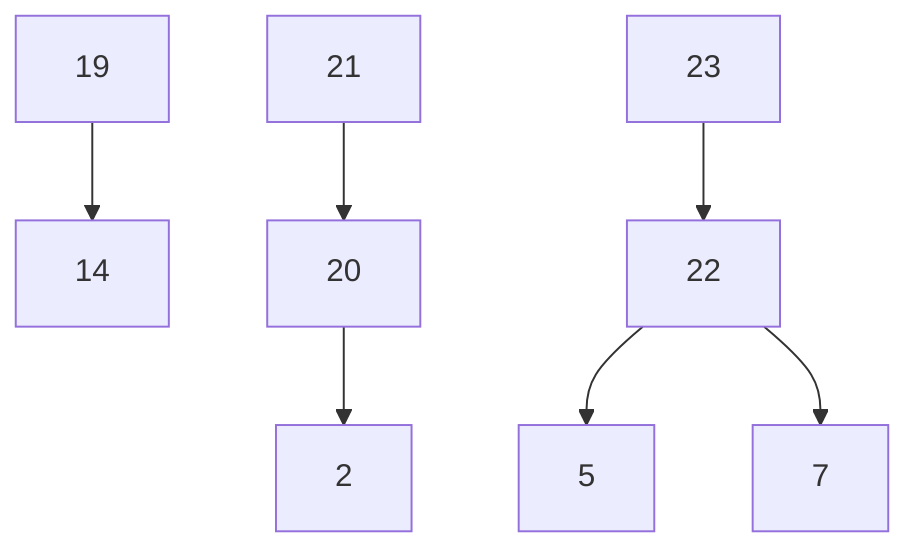

# Implementation Plan

## Overview

手机图片备份系统 - 包含 Python 服务端(FastAPI)、Vue.js Web 前端、Android 客户端和 iOS 客户端的完整图片备份解决方案。

## Tasks

- [x] 1. 项目初始化与基础结构搭建
  - [x] 1.1 创建 Python 项目结构（server/ 目录），初始化 FastAPI 应用
  - [x] 1.2 配置 pyproject.toml / requirements.txt
  - [x] 1.3 创建配置管理模块和 SQLite 数据库初始化
  - [x] 1.4 实现数据库连接池、日志配置、Dockerfile

- [x] 2. 认证模块实现
  - [x] 2.1 实现 AuthService 类和 JWT 令牌管理
  - [x] 2.2 实现 API 端点（login, refresh, test, admin users）
  - [x] 2.3 实现用户管理和权限控制

- [x] 3. 存储路径引擎实现
  - [x] 3.1 实现 StoragePathEngine 类及四种路径组合逻辑
  - [x] 3.2 实现设备名净化、路径验证和路径验证 API

- [x] 4. 重复检测模块实现
  - [x] 4.1 实现 DeduplicationService 类（check, register_file, create_reference）
  - [x] 4.2 实现 API 端点 POST /api/v1/backup/check

- [x] 5. 分块管理器与断点续传实现
  - [x] 5.1 实现 ChunkManager 类（create_session, store_chunk, merge_chunks）
  - [x] 5.2 实现分块校验、过期会话清理
  - [x] 5.3 实现 API 端点（init, chunk, complete, resume）

- [x] 6. 上传管理模块（整合流程）
  - [x] 6.1 实现 UploadService 整合重复检测、分块管理、存储路径引擎
  - [x] 6.2 实现同名文件冲突解决和磁盘空间检查

- [x] 7. 文件浏览服务实现
  - [x] 7.1 实现 FileBrowseService 类（目录浏览、缩略图生成、原图下载）
  - [x] 7.2 实现 API 端点（browse, list, thumbnail, download）

- [x] 8. Web 前端项目初始化
  - [x] 8.1 创建 Vue.js 3 项目并安装依赖
  - [x] 8.2 配置路由、Axios 拦截器、Pinia store

- [x] 9. Web 登录页实现
  - [x] 9.1 实现居中卡片式登录表单和登录逻辑

- [x] 10. Web 图片浏览页实现
  - [x] 10.1 实现目录树导航和图片网格/列表视图
  - [x] 10.2 实现图片预览 Lightbox 和原图下载

- [x] 11. Web 时间线页实现
  - [x] 11.1 实现按年月分组的图片展示和时间轴导航

- [x] 12. Web 设备管理与用户管理页实现
  - [x] 12.1 实现设备管理页和用户管理页（管理员）

- [x] 13. Android 项目初始化与登录界面
  - [x] 13.1 创建 Android 项目并实现登录界面

- [x] 14. Android 功能主界面框架（四个 Tab）
  - [x] 14.1 实现底部导航栏和连接管理器

- [x] 15. Android 本地 Tab 与存储策略配置
  - [x] 15.1 实现文件夹列表和存储策略配置

- [x] 16. Android 后台扫描与备份条件检测
  - [x] 16.1 实现 BackgroundScanService 和备份条件检测

- [x] 17. Android 分块上传与断点续传
  - [x] 17.1 实现 ChunkUploader 和断点续传逻辑

- [x] 18. Android 云端 Tab 与备份任务 Tab
  - [x] 18.1 实现云端浏览和备份任务管理界面

- [x] 19. Android 设置 Tab 完善
  - [x] 19.1 实现存储策略管理组：已配置文件夹列表，点击修改策略
  - [x] 19.2 实现账户信息组：当前用户名、服务器地址、连接状态
  - [x] 19.3 实现退出登录按钮：清除令牌，跳转登录页

- [x] 20. iOS 项目初始化与登录界面
  - [x] 20.1 创建 iOS 项目（ios/ 目录），使用 Swift + SwiftUI
  - [x] 20.2 配置依赖：URLSession, Core Data, BackgroundTasks framework
  - [x] 20.3 实现登录界面（服务器地址、用户名、密码、测试连接、记住密码）
  - [x] 20.4 实现 Keychain 加密存储凭证和 JWT 令牌管理
  - [x] 20.5 实现自动登录

- [x] 21. iOS 功能主界面与后台备份
  - [x] 21.1 实现 TabView 底部导航（本地、云端、备份任务、设置）和连接管理器
  - [x] 21.2 实现后台扫描（BGAppRefreshTask + BGProcessingTask）和 PHPhotoLibrary 监听
  - [x] 21.3 实现备份条件检测和分块上传与断点续传
  - [x] 21.4 实现本地 Tab：文件夹列表、存储策略配置 Sheet
  - [x] 21.5 实现云端 Tab：目录浏览、图片预览
  - [x] 21.6 实现备份任务 Tab：当前任务/历史记录
  - [x] 21.7 实现设置 Tab

- [x] 22. 服务端测试套件
  - [x] 22.1 实现属性测试（Hypothesis）：存储路径引擎、设备名净化、路径验证、重复检测、用户隔离、认证拒绝、断点续传、年月时间提取、同名文件冲突、分块大小
  - [x] 22.2 实现集成测试（pytest + httpx）：完整上传流程、断点续传、认证流程、多用户并发
  - [x] 22.3 实现性能测试：模拟 5 个用户同时上传 100MB 文件

- [x] 23. 部署与运维配置
  - [x] 23.1 完善 Dockerfile 多阶段构建和 docker-compose.yml 数据卷映射
  - [x] 23.2 实现 HTTPS 支持（自签名证书生成脚本 + Let's Encrypt 配置指南）
  - [x] 23.3 实现首次启动向导：创建管理员账户、配置 storage_root
  - [x] 23.4 编写部署文档（README.md）
  - [x] 23.5 实现过期会话定时清理和磁盘空间监控告警

## Task Dependency Graph

## Notes

- Tasks 1-18 are already implemented and verified
- Task 19 partially implemented (backup conditions group done, needs storage strategy management, account info, logout)
- Tasks 20-21 are iOS client (new platform)
- Tasks 22-23 are testing and deployment (depend on server being complete)
- Requirements referenced: 1-19 (see requirements.md)
- Design referenced: see design.md
