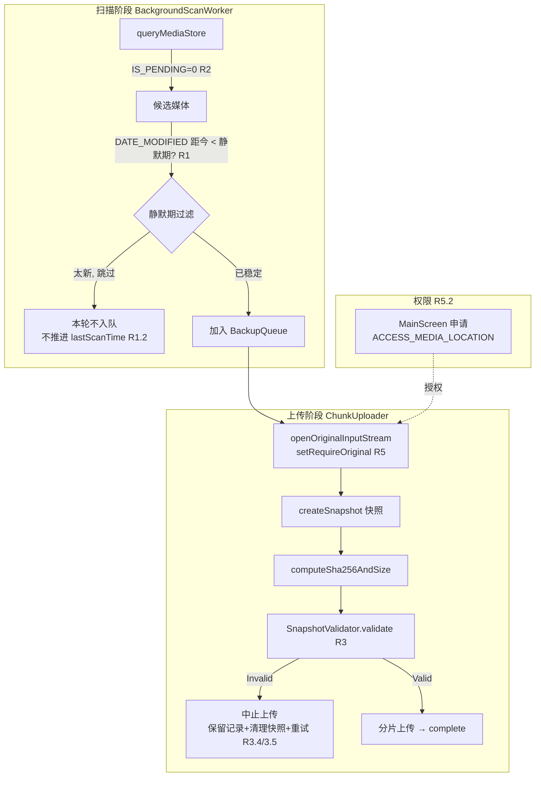

# Design Document

## Overview

本设计在 Android 备份链路中加入三道防护，杜绝「相机仍在写入 / 预分配未写满」的媒体被上传成损坏文件，并让备份字节与设备原图逐字节一致。改动分布在两个执行阶段：

- **扫描阶段** (`BackgroundScanWorker`)：在 MediaStore 查询层过滤 `IS_PENDING`，并在枚举结果上按「静默期」丢弃最近刚修改的文件。
- **上传阶段** (`ChunkUploader` + `FileHasher`)：读取媒体字节前调用 `MediaStore.setRequireOriginal` 获取未脱敏原图；生成快照后由新的 `SnapshotValidator` 做严格的大小一致性 / 尾部零填充 / 多格式结构完整性校验，任一失败即中止并留待重试。

设计目标：默认安全（判据缺失时倾向放行正常文件、判据充分时严格拦截损坏文件）、所有跳过/中止均可诊断、正常文件的上传行为不变、服务端逐字节存储与哈希校验完全不改。

需求映射：扫描静默期 → R1；`IS_PENDING` 过滤 → R2；快照校验 → R3；阈值/常量/日志 → R4；`setRequireOriginal` + 字节一致 → R5。

## Architecture



### 关键设计取舍

- **静默期在「枚举后」过滤，而非放进 SQL selection。** MediaStore 的 `DATE_MODIFIED` 以秒为单位，且各 OEM 对该列语义略有差异；在内存中用 `now - dateModified < QUIET_PERIOD` 判断更直观、易测试，也便于统一日志。计数查询 (`countInCollection`) 不应用静默期过滤（避免总数抖动），只应用 `IS_PENDING=0`（见 R2.3）。
- **`setRequireOriginal` 集中封装在一个 `MediaBytesReader` 中**，供 `ChunkUploader` 的快照读取、预检哈希、EXIF 读取共用，避免三处各写一遍权限/回退逻辑（R5.1/R5.4）。
- **快照校验独立成 `SnapshotValidator`**（纯函数、无 Android 依赖，仅接收 `File` + 期望大小 + 文件名/MIME），便于用 property-based testing 覆盖多格式。
- **严格相等 + 保守放行并存**：大小校验零容差（R3.1/R4.5）；但当「判据不可用」（拿不到 MediaStore.SIZE、无法识别格式）时不因该单条规则拦截（R4.3）。两者不冲突：严格相等只在「拿得到可信 SIZE」时执行。

## Components and Interfaces

### 1. MediaBytesReader（新增）

封装「优先原始字节 + 安全回退」的输入流打开逻辑，是 R5 的单一入口。

```kotlin
@Singleton
class MediaBytesReader @Inject constructor() {

    /**
     * Opens an InputStream for [uri], requesting the un-redacted original bytes
     * (incl. location EXIF) on API 29+ via MediaStore.setRequireOriginal.
     * Falls back to a plain open if the permission is missing or the device/URI
     * doesn't support it. Logs whenever a fallback happens. (R5.1/R5.4/R5.6)
     */
    fun openOriginal(context: Context, uri: Uri): InputStream

    /** True if ACCESS_MEDIA_LOCATION is currently granted. */
    fun hasMediaLocationPermission(context: Context): Boolean
}
```

行为要点：
- API ≥ 29 且权限已授予：`val original = MediaStore.setRequireOriginal(uri)`，再 `contentResolver.openInputStream(original)`。
- `setRequireOriginal` / open 抛 `UnsupportedOperationException` 或其它异常，或权限未授予：回退 `contentResolver.openInputStream(uri)`，并 `Log.i` 记录回退原因（R5.4）。
- API < 29：直接普通打开（R5.6）。

### 2. FileHasher（改造）

`computeSha256(context, uri)` 与 `computeSha256AndSize(context, uri)` 改为通过 `MediaBytesReader.openOriginal` 打开流（而非直接 `contentResolver.openInputStream`），使预检哈希也基于原始字节（R5.1）。基于 `File` 的重载不变。

`createSnapshot` 同样改用 `MediaBytesReader.openOriginal`（见下）。这样「预检哈希、快照哈希、上传字节」三者一致，避免脱敏读取导致 R3 大小校验误判（R5.5）。

### 3. SnapshotValidator（新增，纯逻辑，PBT 重点）

```kotlin
sealed interface SnapshotValidation {
    object Valid : SnapshotValidation
    data class Invalid(val reason: Reason, val detail: String) : SnapshotValidation
    enum class Reason { SIZE_MISMATCH, TRAILING_ZERO_PADDING, TRUNCATED_STRUCTURE }
}

object SnapshotValidator {
    /**
     * @param snapshot     staged on-disk snapshot
     * @param snapshotSize exact bytes of the snapshot (from FileHasher)
     * @param expectedSize MediaStore.SIZE if trustworthy, else null (R4.3)
     * @param fileName     used to detect format by extension
     * @param mimeType     used as a secondary format hint
     */
    fun validate(
        snapshot: File,
        snapshotSize: Long,
        expectedSize: Long?,
        fileName: String,
        mimeType: String?
    ): SnapshotValidation
}
```

校验顺序与规则：

1. **大小一致性 (R3.1, 严格相等)**：`expectedSize != null && expectedSize != snapshotSize` → `Invalid(SIZE_MISMATCH)`。`expectedSize == null`（不可信/取不到）→ 跳过本条（R4.3）。
2. **尾部零填充 (R3.2, R4.2)**：从文件尾部反向统计连续 `0x00` 长度 `z`。判定为损坏当且仅当 `z >= max(TRAILING_ZERO_MIN_ABS, snapshotSize * TRAILING_ZERO_MIN_RATIO)`。常量默认 `TRAILING_ZERO_MIN_ABS = 64 * 1024`（64KB），`TRAILING_ZERO_MIN_RATIO = 0.10`。合法图片极少以数十 KB 连续零结尾，故可靠区分 MVIMG 那种「MB 级零填充」而不误伤正常尾部少量零。
3. **格式结构完整性 (R3.3, R3.7)**：按扩展名/MIME 选择 checker：
   - JPEG：最后两字节 `FF D9`。
   - PNG：最后 8 字节 `49 45 4E 44 AE 42 60 82`（IEND+CRC）。
   - GIF：头 `GIF87a`/`GIF89a` 且末字节 `0x3B`。
   - WebP：`RIFF`+`WEBP`，且偏移 4 处 little-endian 长度 `== snapshotSize - 8`。
   - HEIC/HEIF/AVIF（ISO-BMFF）：从 0 顺序遍历顶层 box（`size(4) + type(4)`，含 64-bit largesize），累加应恰好 `== snapshotSize` 且含 `ftyp`；否则视为截断。
   - 未识别格式 / 校验依据不足：返回 `Valid`（R4.3 保守放行），大小与零填充校验已先行拦截明显损坏。
   任一 checker 判不完整 → `Invalid(TRUNCATED_STRUCTURE)`。

校验器全部只读文件头尾少量字节（结构遍历只读 box 头），不整文件加载，避免大图内存压力。

### 4. BackgroundScanWorker（改造）

- `queryMediaStore` / `countInCollection` 的 selection 在 API ≥ 29 追加 `AND IS_PENDING = 0`（R2.1/R2.2/R2.3）。API < 29 不加（无该列）。
- `queryMediaStore` 返回结果后，对每个 `FileInfo` 应用静默期过滤：`(now - createdTime) < QUIET_PERIOD_MS` 则丢弃并 `Log.i`（R1.1/R1.6）。`createdTime`（= `DATE_MODIFIED`）为 0 时不过滤（R1.5）。
- **不推进 lastScanTime 越过被跳过文件 (R1.2)**：`scanAllFolders` 目前把 `lastScanTime` 设为 `currentTime`。改为：本轮若存在「因静默期被跳过的文件」，则将该文件夹 `lastScanTime` 取 `min(currentTime, earliestSkippedModifiedTime)`（用被跳过文件里最早的 `DATE_MODIFIED` 作为下界），保证下轮增量扫描仍能重新枚举它们。无跳过时维持 `currentTime`。
- 静默期过滤对 `forceFullScan` 与周期扫描一致生效（R1.4）——过滤发生在 `queryMediaStore` 结果层，两条路径共用。

### 5. ChunkUploader（改造，接入点）

在 `uploadFile` 中：
- `createSnapshot` 内部 `openInputStream` 改为 `mediaBytesReader.openOriginal(context, fileUri)`（R5.1）。
- 计算 `actualSize` 后、`resolveSession` 之前插入校验：
  ```kotlin
  val expected = fileInfo.fileSize.takeIf { it > 0 } // MediaStore.SIZE, null if untrusted
  when (val v = SnapshotValidator.validate(snapshot, actualSize, expected, fileInfo.fileName, fileInfo.mimeType)) {
      is SnapshotValidation.Invalid -> {
          Log.w("PhotoVaultBackup", "snapshot invalid ${fileInfo.fileName}: ${v.reason} ${v.detail} mediaStoreSize=${fileInfo.fileSize} snapshotSize=$actualSize")
          // finally{} already deletes the snapshot (R3.5); keep upload record for retry (R3.4)
          return UploadResult.Failed("Source not fully written yet: ${v.reason}", shouldRetry = true)
      }
      SnapshotValidation.Valid -> { /* proceed */ }
  }
  ```
- 现有 `finally { snapshot.delete() }` 已覆盖 R3.5 的临时文件清理；`shouldRetry = true` 触发既有重试机制（R3.4）。既有的哈希/分片/complete 流程对合法文件保持不变（R3.6）。

### 6. 权限申请（MainScreen 改造，R5.2）

`MainScreen` 的 `LaunchedEffect` 权限数组，在 API ≥ 29 追加 `ACCESS_MEDIA_LOCATION`（该权限在 API 29 引入）。清单已在需求阶段确认需新增 `<uses-permission android:name="android.permission.ACCESS_MEDIA_LOCATION" />`。未授予时 `MediaBytesReader` 走回退，不阻断备份（R5.4）。

### 7. 常量集中（R4.1）

新增 `BackupTuning`（或置于各自 companion，但集中更利于调整）：
```kotlin
object BackupTuning {
    const val QUIET_PERIOD_MS = 120_000L          // R1 静默期，默认120s
    const val TRAILING_ZERO_MIN_ABS = 64 * 1024   // R3.2/R4.2
    const val TRAILING_ZERO_MIN_RATIO = 0.10
}
```

## Data Models

无持久化 schema 变更。新增内存类型：`SnapshotValidation`（sealed）、`HashAndSize`（已存在）。`FileInfo` 保持不变（`fileSize` 继续承载 MediaStore.SIZE，作为 `expectedSize` 输入）。

## Correctness Properties

用于 property-based testing 的可执行属性（`SnapshotValidator` 为核心可测单元）：

### Property 1: 正常文件放行
对任意「大小与 expectedSize 相等、无大块尾零、结构完整」的合法输入，`validate` 恒返回 `Valid`。

**Validates: Requirements 3.6**

### Property 2: 零填充必被拦截
对任意合法基图，追加 `n (>= 阈值)` 个 `0x00` 得到的文件，`validate` 返回 `Invalid`（`TRAILING_ZERO_PADDING` 或 `SIZE_MISMATCH`）。覆盖 MVIMG 案例。

**Validates: Requirements 3.2**

### Property 3: 大小严格相等
当 `expectedSize != null` 且 `!= snapshotSize`（相差 ≥1 字节），必返回 `Invalid(SIZE_MISMATCH)`；相差 0 时该条不触发。

**Validates: Requirements 3.1, 4.5**

### Property 4: 截断结构被拦截
对合法 JPEG/PNG/GIF/WebP/HEIF 从任意位置截断（去掉结束标记），当 `expectedSize` 设为截断后大小以绕过 Property 3 时，仍返回 `Invalid(TRUNCATED_STRUCTURE)`。

**Validates: Requirements 3.3, 3.7**

### Property 5: 保守放行不误杀
`expectedSize == null` 且格式不可识别且无大块尾零的任意字节串，返回 `Valid`。

**Validates: Requirements 4.3**

### Property 6: 静默期单调性
给定文件 `dateModified`，`shouldSkipForQuietPeriod(now, dateModified)` 在 `now - dateModified < QUIET_PERIOD_MS` 为真、`>=` 为假；`dateModified == 0` 恒为假。

**Validates: Requirements 1.1, 1.5**

### Property 7: lastScanTime 不漏扫
若本轮存在被跳过文件，新的 `lastScanTime <= min(所有被跳过文件的 dateModified)`，保证下轮 `DATE_MODIFIED > lastScanTime` 仍能命中它们。

**Validates: Requirements 1.2**

## Error Handling

- `MediaBytesReader.openOriginal`：任何原始读取异常 → 回退普通读取；普通读取仍失败则向上抛，由 `ChunkUploader` 既有 catch 转为 `Failed(shouldRetry=true)`。
- `SnapshotValidator`：读取快照发生 IO 异常时，视为「判据不可用」返回 `Valid`（保守，R4.3），并记 debug 日志——避免因校验器自身 IO 抖动阻断正常备份。
- 扫描查询异常：维持既有 try/catch 返回空列表行为，不因新增 selection 崩溃（R2.2）。

## Testing Strategy

- **单元 / PBT**：`SnapshotValidator` 用 property-based tests 覆盖 P1–P5，并对每种格式各准备合法样例 + 变异（追加零、截断）。静默期与 lastScanTime 逻辑抽为纯函数覆盖 P6/P7。
- **交互测试**：`MediaBytesReader` 用 Robolectric/mock `ContentResolver`，验证 API 29+ 调用 `setRequireOriginal`、权限缺失/异常时回退且记日志。
- **回归**：现有 `ChunkUploader` / 扫描相关测试保持通过；新增一条「合法文件不受影响」用例（R3.6）。
- **端到端手测**：用真实 MVIMG 复现——拍摄后立即触发备份，验证静默期跳过；构造截断文件验证上传前拦截；授予/回收 `ACCESS_MEDIA_LOCATION` 验证字节一致与回退。
