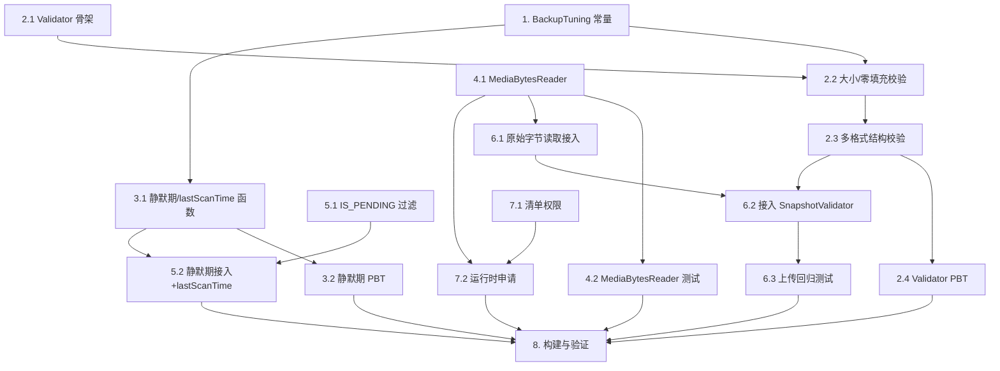

# Implementation Plan

## Overview

在 Android 备份链路加入三道防护（扫描静默期跳过、`IS_PENDING` 过滤、上传前快照校验）并实现字节级一致（`setRequireOriginal` + `ACCESS_MEDIA_LOCATION`）。实现顺序：先落地纯逻辑组件（`BackupTuning`、`SnapshotValidator`、静默期函数）并用 property-based testing 覆盖，再实现 `MediaBytesReader`，最后接入扫描 / 上传 / 权限，收尾统一构建验证。

## Tasks

- [x] 1. 新增调优常量 BackupTuning
  - 创建 `android/app/src/main/java/com/photovault/service/BackupTuning.kt`
  - 定义 `QUIET_PERIOD_MS = 120_000L`、`TRAILING_ZERO_MIN_ABS = 64 * 1024`、`TRAILING_ZERO_MIN_RATIO = 0.10`
  - 全部为具名常量，不散落魔法数字
  - _Requirements: 4.1_

- [x] 2. 实现 SnapshotValidator 及其数据类型
- [x] 2.1 定义 SnapshotValidation 密封类型与 SnapshotValidator 骨架
  - 创建 `android/app/src/main/java/com/photovault/service/SnapshotValidator.kt`
  - 定义 `SnapshotValidation`（`Valid` / `Invalid(reason, detail)`）与 `Reason` 枚举（`SIZE_MISMATCH`/`TRAILING_ZERO_PADDING`/`TRUNCATED_STRUCTURE`）
  - `validate(snapshot, snapshotSize, expectedSize, fileName, mimeType)` 签名就位
  - _Requirements: 3.1, 3.2, 3.3_

- [x] 2.2 实现大小一致性与尾部零填充校验
  - 大小：`expectedSize != null && expectedSize != snapshotSize` → `Invalid(SIZE_MISMATCH)`（严格相等，零容差）；`expectedSize == null` 跳过本条
  - 尾部零填充：从文件尾反向数连续 `0x00`，`z >= max(TRAILING_ZERO_MIN_ABS, snapshotSize * TRAILING_ZERO_MIN_RATIO)` → `Invalid(TRAILING_ZERO_PADDING)`
  - 仅读取尾部必要字节，避免整文件加载
  - _Requirements: 3.1, 3.2, 4.2, 4.5_

- [x] 2.3 实现多格式结构完整性校验
  - 按扩展名/MIME 分派 checker：JPEG(`FF D9`)、PNG(`IEND`+CRC)、GIF(头 `GIF87a/89a` + 末 `0x3B`)、WebP(`RIFF`/`WEBP` + RIFF 长度=size-8)、HEIC/HEIF/AVIF(ISO-BMFF 顶层 box 长度累加==size 且含 `ftyp`)
  - 判不完整 → `Invalid(TRUNCATED_STRUCTURE)`
  - 未识别格式 / 依据不足 → `Valid`（保守放行）
  - checker 只读 box 头/文件头尾少量字节
  - _Requirements: 3.3, 3.7, 4.3_

- [x] 2.4 SnapshotValidator 属性测试 (PBT)
  - 创建 `android/app/src/test/java/com/photovault/service/SnapshotValidatorPropertyTest.kt`
  - 各格式合法样例生成器 + 变异（追加零、任意位置截断）
  - 覆盖 Property 1（正常放行）、2（零填充拦截）、3（大小严格相等）、4（截断拦截）、5（保守放行不误杀）
  - _Requirements: 3.1, 3.2, 3.3, 3.6, 3.7, 4.3, 4.5_

- [x] 3. 静默期与漏扫防护的纯逻辑函数
- [x] 3.1 抽出 shouldSkipForQuietPeriod 与 lastScanTime 计算
  - 在 `BackgroundScanWorker`（或同包工具）中新增纯函数：`shouldSkipForQuietPeriod(now, dateModified)`、`computeNextScanTime(currentTime, skippedModifiedTimes)`
  - `dateModified == 0` 时不跳过；有跳过文件时 `lastScanTime = min(currentTime, 最早被跳过的 dateModified)`
  - _Requirements: 1.1, 1.2, 1.5_

- [x] 3.2 静默期/漏扫逻辑的属性测试 (PBT)
  - 创建 `android/app/src/test/java/com/photovault/service/QuietPeriodPropertyTest.kt`
  - 覆盖 Property 6（静默期单调性 + dateModified=0）、Property 7（lastScanTime 不漏扫）
  - _Requirements: 1.1, 1.2, 1.5_

- [x] 4. 实现 MediaBytesReader（setRequireOriginal + 回退）
- [x] 4.1 创建 MediaBytesReader
  - 创建 `android/app/src/main/java/com/photovault/service/MediaBytesReader.kt`
  - `openOriginal(context, uri)`：API≥29 且授权 → `MediaStore.setRequireOriginal` 后 open；异常/未授权 → 回退普通 open 并 `Log.i` 回退原因；API<29 直接普通 open
  - `hasMediaLocationPermission(context)`
  - _Requirements: 5.1, 5.4, 5.6_

- [x] 4.2 MediaBytesReader 交互测试
  - 创建 `android/app/src/test/java/com/photovault/service/MediaBytesReaderTest.kt`（Robolectric / mock ContentResolver）
  - 验证 API29+ 调用 setRequireOriginal、权限缺失与异常时回退且记日志
  - _Requirements: 5.1, 5.4, 5.6_

- [x] 5. 接入扫描阶段过滤（BackgroundScanWorker）
- [x] 5.1 查询层加入 IS_PENDING 过滤
  - `queryMediaStore` 与 `countInCollection` 在 API≥29 的 selection 追加 `AND IS_PENDING = 0`；API<29 不加
  - 保持既有 try/catch 空列表容错
  - _Requirements: 2.1, 2.2, 2.3, 2.4_

- [x] 5.2 结果层应用静默期过滤并修正 lastScanTime
  - `queryMediaStore` 结果按 `shouldSkipForQuietPeriod` 丢弃并 `Log.i`（文件名 + 距今秒数）
  - `scanAllFolders` 用 `computeNextScanTime` 设定各文件夹 `lastScanTime`（存在跳过时回退）
  - 对 forceFullScan 与周期扫描一致生效
  - _Requirements: 1.1, 1.2, 1.3, 1.4, 1.6_

- [x] 6. 接入上传阶段（FileHasher + ChunkUploader）
- [x] 6.1 FileHasher/createSnapshot 改用原始字节读取
  - 注入 `MediaBytesReader`；`computeSha256(context,uri)`、`computeSha256AndSize(context,uri)` 与 `ChunkUploader.createSnapshot` 的 `openInputStream` 改为 `openOriginal`
  - 更新受影响构造/DI（Hilt）
  - _Requirements: 5.1, 5.3, 5.5_

- [x] 6.2 在上传流程接入 SnapshotValidator
  - `ChunkUploader.uploadFile` 计算 `actualSize` 后、`resolveSession` 前调用 `SnapshotValidator.validate`（`expectedSize = fileInfo.fileSize.takeIf { it > 0 }`）
  - `Invalid` → `Log.w` 结构化日志 + 返回 `Failed(shouldRetry=true)`（依赖既有 `finally` 删快照、保留上传记录）
  - `Valid` → 维持既有流程不变
  - _Requirements: 3.1, 3.2, 3.3, 3.4, 3.5, 3.6, 5.5_

- [x] 6.3 上传接入的回归/新增测试
  - 合法文件仍正常完成（行为不变）；损坏快照返回 `Failed(shouldRetry=true)` 且不发起 complete
  - _Requirements: 3.4, 3.5, 3.6_

- [x] 7. 权限：ACCESS_MEDIA_LOCATION
- [x] 7.1 清单声明权限
  - `AndroidManifest.xml` 新增 `<uses-permission android:name="android.permission.ACCESS_MEDIA_LOCATION" />`
  - _Requirements: 5.2_

- [x] 7.2 运行时申请
  - `MainScreen` 权限数组在 API≥29 追加 `ACCESS_MEDIA_LOCATION`
  - 未授予不阻断（由 MediaBytesReader 回退兜底）
  - _Requirements: 5.2, 5.4_

- [x] 8. 构建与验证
  - 运行 `./gradlew :app:testDebugUnitTest`（含 PBT）与 `./gradlew :app:assembleDebug`
  - 修复编译/测试问题
  - _Requirements: 1.1, 2.1, 3.1, 4.1, 5.1_

## Task Dependency Graph



```json
{
  "waves": [
    { "wave": 1, "tasks": ["1", "2.1", "4.1", "7.1"] },
    { "wave": 2, "tasks": ["2.2", "3.1", "4.2", "5.1", "6.1", "7.2"] },
    { "wave": 3, "tasks": ["2.3", "3.2", "5.2"] },
    { "wave": 4, "tasks": ["2.4", "6.2"] },
    { "wave": 5, "tasks": ["6.3"] },
    { "wave": 6, "tasks": ["8"] }
  ]
}
```

## Notes

- 可并行起步的无依赖任务：任务 1（常量）、任务 2.1（Validator 骨架）、任务 4.1（MediaBytesReader）。
- 纯逻辑组件（`SnapshotValidator`、静默期函数）先于接入任务完成，便于 PBT 尽早覆盖 Property 1–7。
- 任务 6.1 会调整 Hilt 注入（`FileHasher`/`ChunkUploader` 依赖 `MediaBytesReader`），接入时留意构造签名变化。
- 长期未 finalize 的边界（相机异常）由静默期 + 上传前校验双重兜底；本 spec 不含自动重新备份（用户已明确不需要）。
- 端到端手测建议用真实 MVIMG：拍摄后立即备份验证静默期，构造截断文件验证上传拦截，切换 `ACCESS_MEDIA_LOCATION` 验证字节一致与回退。
